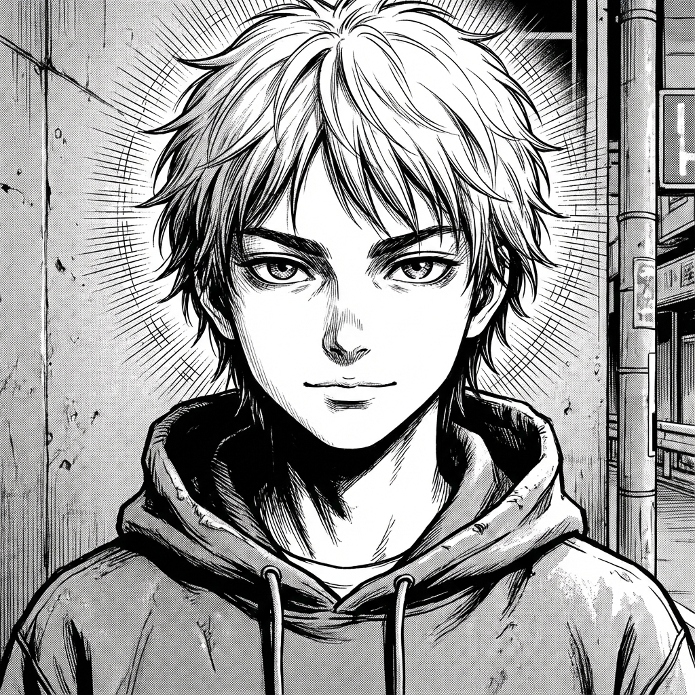

# Parte I: Qué es el Aura

Aquí vamos a limpiar el terreno. Hay mucha confusión sobre qué te hace respetar y qué te hace parecer un desesperado. Antes de aprender las técnicas para no explotar ni ceder, necesitas entender qué es exactamente lo que estamos protegiendo.

En esta parte vas a entender:

*   Por qué algunos tienen presencia sin abrir la boca.
*   Por qué intentar ser "popular" suele destruir tu aura.
*   La regla de oro que separa a los líderes de los seguidores (y no es mandar).

Olvídate de trucos de magia. Esto va de señales sociales reales. Empezamos.
