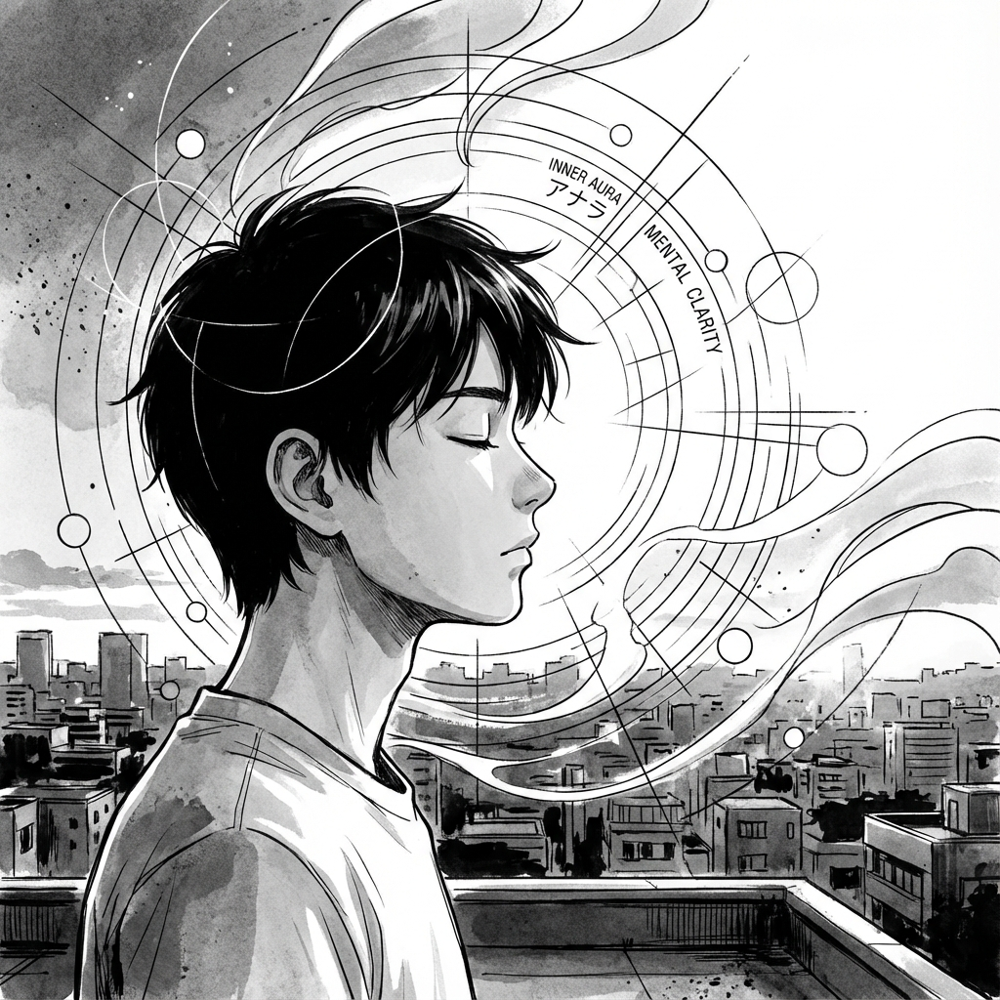

# Parte V: Aura Interior

 (la parte que no se ve)

Todo lo que hemos visto hasta ahora (pausas, contacto visual, frases cortas) son las ramas del árbol.
Esta parte son las raíces.

Si por dentro estás temblando, lleno de vergüenza o desesperado por gustar, las técnicas externas solo durarán un rato. Tarde o temprano, la fachada se cae.

El aura real nace de una tranquilidad interna. De saber quién eres y de no venderte barato.
Aquí vamos a hablar de cómo proteger tu mente para que tu cuerpo pueda proyectar seguridad sin esfuerzo.
Confianza no es "saber que vas a ganar". Confianza es "saber que estarás bien aunque pierdas".
