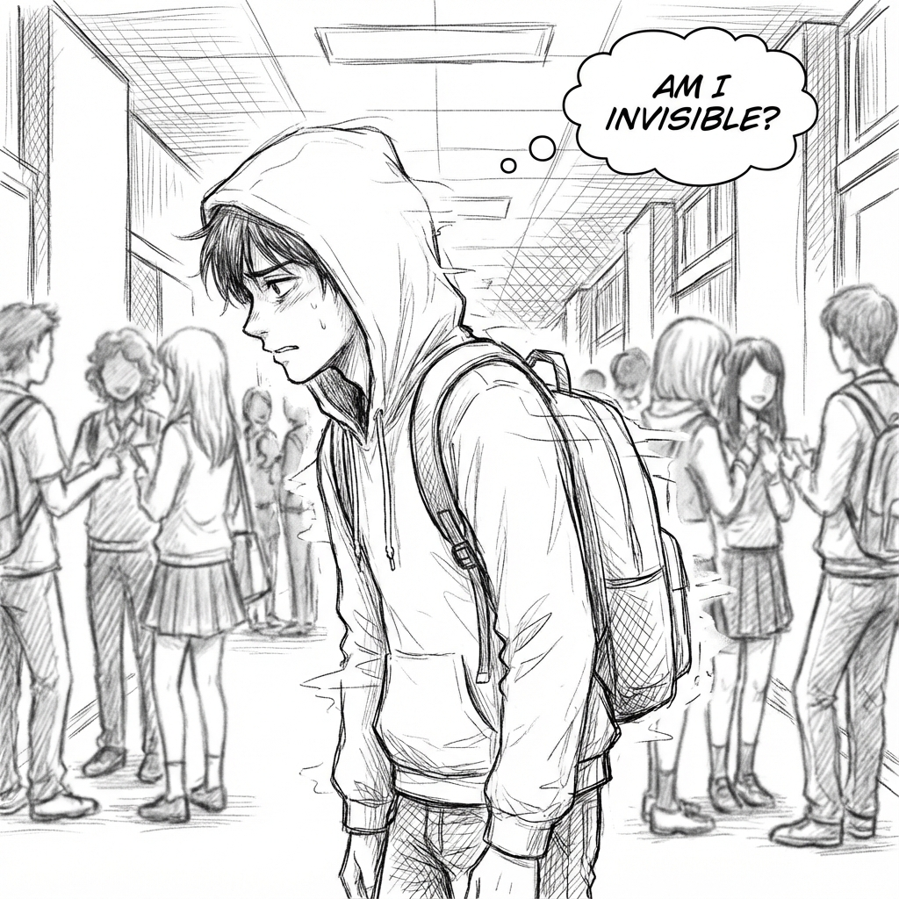

# Parte II: La Caída

## El Abismo

Crees que tienes el control.
Crees que cuando alguien te insulta y saltas a defenderte, estás siendo "fuerte".
Crees que cuando te ríes de una broma que no tiene gracia, estás siendo "simpático".

Te equivocas.
Estás sangrando poder.

En esta parte, vamos a ver cómo se desmorona todo.
Vas a presenciar situaciones que te dolerán físicamente porque te recordarab a tus propios errores. Verás cómo el ego, el miedo y la necesidad de encajar empujan a nuestros protagonistas hacia el precipicio.

Es fácil leer sobre el Aura. Lo difícil es mantenerla cuando tienes el corazón a mil y alguien te está humillando delante de todos.
Prepárate. Antes de aprender a levantarse, hay que aprender lo duro que está el suelo.

**Cuidado. La caída es rápida.**
