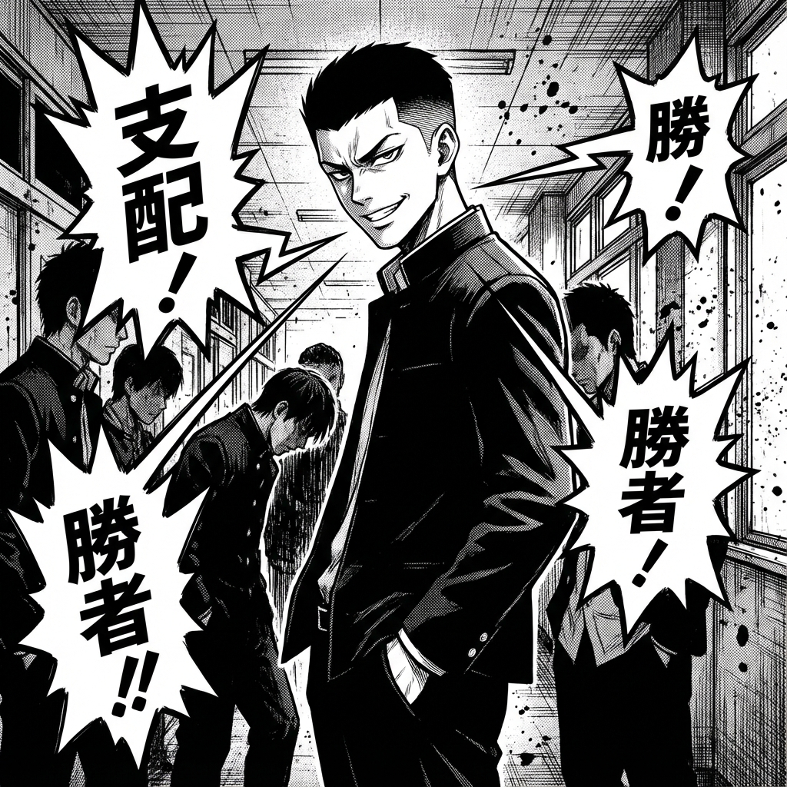

# Parte III: El Ascenso

## El Entrenamiento

Dicen que la definición de locura es hacer lo mismo una y otra vez y esperar resultados diferentes.
Leo y Vega llevan años haciendo lo mismo: huir o pelear.
Y llevan años perdiendo.

Pero ¿qué pasaría si un día, de repente, cambiaran el guion?
¿Qué pasaría si ante un insulto, hubiera silencio?
¿Qué pasaría si ante una orden, hubiera un "no" tranquilo?

En esta sección, se rompe la inercia.
Vas a descubrir herramientas que parecen pequeñas —una pausa, una mirada, una retirada— pero que tienen el peso de una bomba atómica social.
El equilibrio de poder en el instituto está a punto de temblar. Y los que están arriba van a empezar a sentir frío.

**La subida comienza ahora.**
