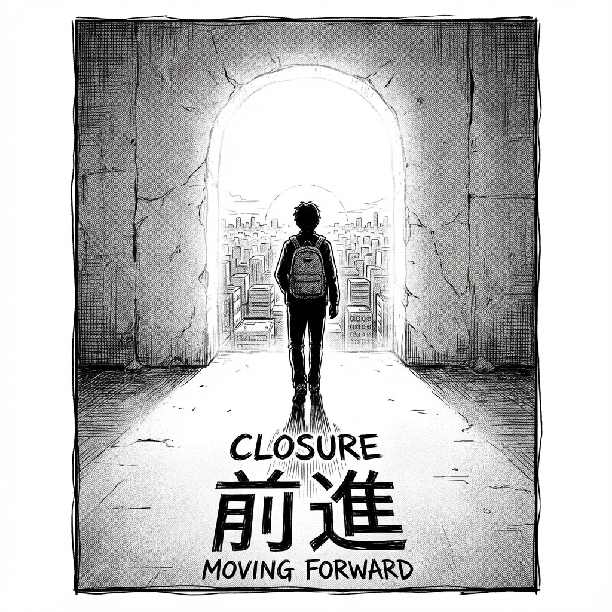

# Parte VI: El Regreso

## El Maestro de los Dos Mundos

¿Qué pasa después de ganar?
¿Qué pasa cuando el monstruo que te aternizaba de repente te parece... pequeño?

El final del viaje no es derrotar al villano. Eso es lo que nos venden las películas, pero la vida no funciona así.
El verdadero final es algo mucho más extraño. Más silencioso. Y mucho más poderoso.

Leo y Vega han llegado al final del camino.
Lo que van a descubrir aquí cambiará para siempre su forma de ver el mundo. Y si has llegado hasta aquí, también cambiará la tuya.
Prepárate para soltar todo lo que creías que necesitabas.

**La libertad no es lo que esperas.**
