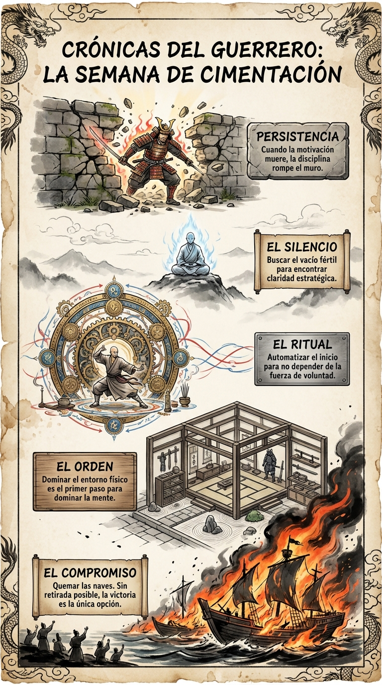

# Resumen Semana 1: Demolición y Cimentación

> *"El comienzo es la parte más importante del trabajo."*
> — **Platón**

## Los 7 Pilares (El Ascenso)

1.  **Día 1: El Compromiso (La Piedra Angular)**
    *   *Quemamos las naves.* La "opción B" es el enemigo. Sin retirada posible, la victoria es la única salida. Decisión irrevocable.

2.  **Día 2: El Orden (El Primer Bloque)**
    *   *Hicimos la cama.* Dominio sobre el caos externo = Primer paso para el dominio interno. El entorno refleja la mente.

3.  **Día 3: El Ritual (El Engranaje)**
    *   *Creamos el "Taxi".* Automatización del inicio. Se elimina la negociación con la propia pereza. La acción precede a la motivación.

4.  **Día 4: La Auditoría (La Plomada)**
    *   *Nos detuvimos a medir.* Sin análisis, la acción es ciega. Pausa estratégica para evaluar coordenadas y ajustar el rumbo.

5.  **Día 5: El Silencio (El Vacío)**
    *   *Buscamos el vacío.* En un mundo de ruido, el silencio es la única fuente de claridad estratégica. Conexión interna.

6.  **Día 6: La Incomodidad (El Escudo Helado)**
    *   *Abrazamos el frío.* Vacuna mental contra el miedo a la escasez. La incomodidad voluntaria forja la resiliencia.

7.  **Día 7: La Persistencia (El Rompe-Muros)**
    *   *Golpeamos el Muro.* Cuando la motivación muere, la rutina es el salvavidas. Resistencia en el estancamiento.

## Arco Narrativo Semanal

Hemos viajado desde la **Decisión Irrevocable** (quemar los barcos) hasta la **Resistencia en el Estancamiento** (el muro). Esta semana no ha sido sobre construir hacia arriba, sino sobre limpiar el terreno y poner los cimientos bajo tierra. Hemos destruido las vías de escape del civil para permitir el nacimiento del guerrero.
