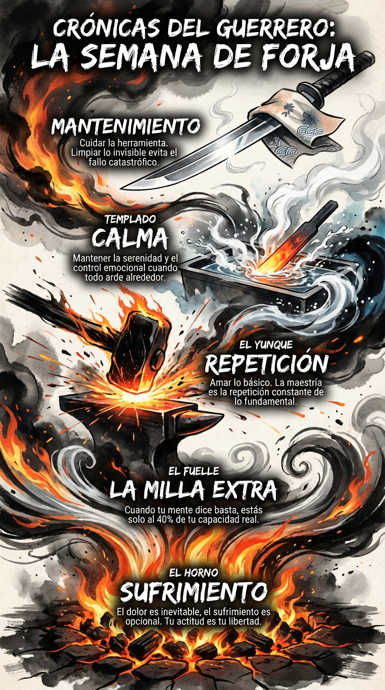

# Resumen Semana 2: Resistencia y Calidad

> *"La disciplina es el puente entre metas y logros."*
> — **Jim Rohn**

## Síntesis Visual: La Forja Vertical

La imagen de esta semana representa el proceso de transformación del acero (y del carácter) a través del fuego y el agua.

1.  **El Fuego (Base):** El horno ruge abajo. Representa el **Sufrimiento** y la **Milla Extra**. Sin calor extremo, no hay cambio.
2.  **El Golpe (Centro):** El martillo impacta el acero. Es la **Repetición** y el dolor necesario para dar forma.
3.  **El Templado (Cima):** El vapor se eleva donde el acero toca el agua. Es la **Calma bajo Fuego** y el **Mantenimiento**. La hoja emerge perfecta y limpia.

## Los 7 Pilares

1.  **Día 8:** Dolor vs. Sufrimiento (Actitud).
2.  **Día 9:** La Milla Extra (Regla del 40%).
3.  **Día 10:** Calma bajo Fuego (Control Emocional).
4.  **Día 11:** La Queja (Auditoría de Energía).
5.  **Día 12:** Ayuno de Dopamina (Claridad).
6.  **Día 13:** Mantenimiento (Cuidar la Herramienta).
7.  **Día 14:** Repetición (Amar lo Básico).

## Arco Narrativo

Hemos subido desde el caos del fuego hasta la claridad del filo templado. La resistencia no es solo aguantar el golpe, es usarlo para afilarse.
