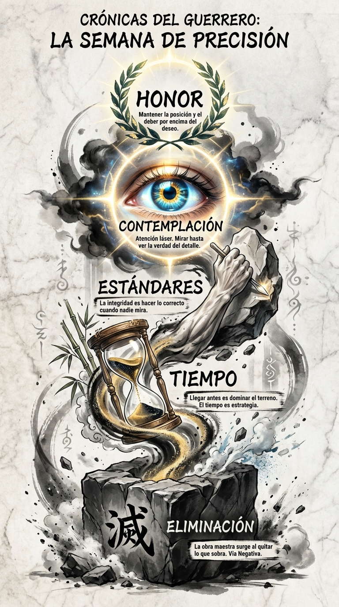

# Resumen Semana 3: Excelencia y Detalle

> *"La calidad no es un acto, es un hábito."*
> — **Aristóteles**

## Síntesis Visual: La Escultura Emergente

La imagen muestra la talla de una estatua sagrada emergiendo de la roca bruta, simbolizando la búsqueda de la perfección.

1.  **La Roca (Base):** El bloque tosco y el polvo que cae representan la **Eliminación** de lo superfluo.
2.  **La Forma (Centro):** Un torso o mano perfecta emerge de la piedra. El reloj de arena simboliza el **Tiempo** y la **Puntualidad** como herramientas de precisión.
3.  **El Ojo (Cima):** Un ojo realista y brillante domina la parte superior, representando la **Contemplación** y la atención al detalle absoluto.

## Los 7 Pilares

1.  **Día 15:** La Eliminación (Vía Negativa).
2.  **Día 16:** Los Estándares (La Parte Trasera).
3.  **Día 17:** La Puntualidad (Ventaja de Nelson).
4.  **Día 18:** La Auditoría (Búsqueda de Errores).
5.  **Día 19:** La Contemplación (Atención Láser).
6.  **Día 20:** El Deber (Deber sobre Deseo).
7.  **Día 21:** El Honor (Principios sobre Supervivencia).

## Arco Narrativo

Hemos pasado de quitar lo que sobra (cincel) a defender lo que importa (honor). La excelencia no es añadir más, es pulir hasta que solo quede la verdad.
