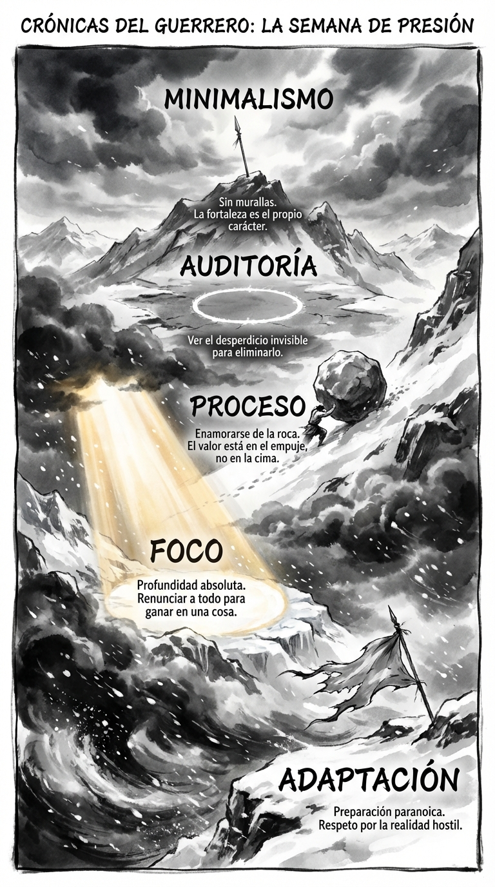

# Resumen Semana 4: Constancia bajo Presión

> *"La persistencia es a la personalidad del hombre lo que el carbono es al acero."*
> — **Napoleón Hill**

## Síntesis Visual: El Ascenso Imposible

La imagen retrata la subida a una montaña sagrada bajo una tormenta invernal.

1.  **La Tormenta (Base):** La ventisca y la bandera rota representan la **Adaptación** necesaria ante la realidad hostil.
2.  **El Esfuerzo (Centro):** Una figura empuja una roca brillante cuesta arriba. Es el **Absurdo** y el amor por el proceso (Sísifo).
3.  **La Cumbre (Cima):** En el pico, una lanza solitaria se mantiene firme bajo el cielo despejado. Es el **Minimalismo** y la fortaleza desnuda de Esparta.

## Los 7 Pilares

1.  **Día 22:** La Adaptación (Preparación Paranoica).
2.  **Día 23:** El Foco (Profundidad Absoluta).
3.  **Día 24:** El Absurdo (Sísifo Feliz).
4.  **Día 25:** La Revisión (Análisis de Datos).
5.  **Día 26:** La Integración (Silencio).
6.  **Día 27:** La Auditoría (Ver el Desperdicio).
7.  **Día 28:** El Minimalismo (Murallas Humanas).

## Arco Narrativo

Hemos escalado desde la preparación paranoica en la base hasta la fortaleza desnuda en la cima. La presión externa solo se vence con una estructura interna indestructible.
