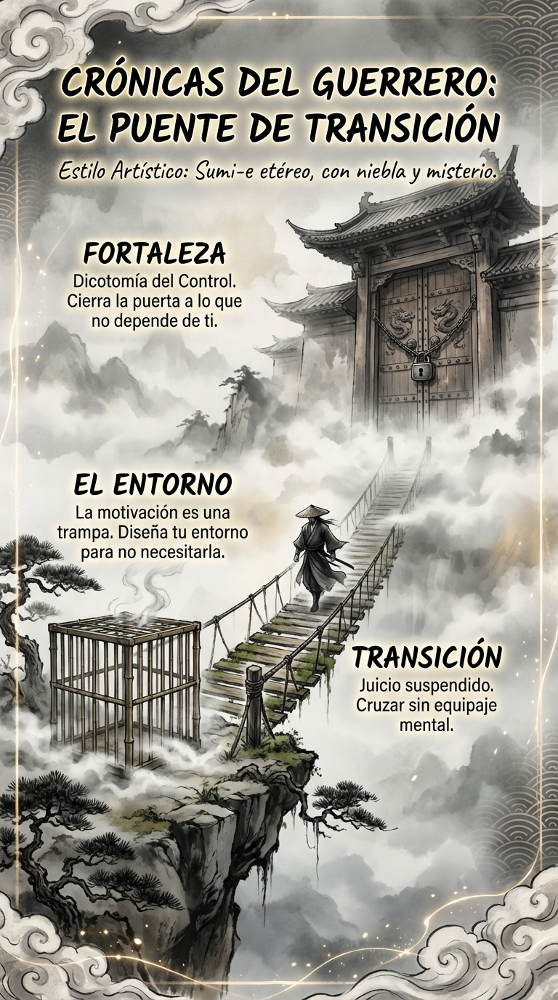

# Resumen Semana 5: El Puente al Autocontrol

> *"El final es el principio."*
> — **Lao-Tse**

## Síntesis Visual: El Cruce Místico

La imagen muestra un puente antiguo cruzando un abismo de niebla, conectando dos mundos.

1.  **El Abismo (Base):** Una jaula vacía queda atrás en el precipicio. Representa el **Entorno** y la trampa de la motivación que abandonamos.
2.  **El Puente (Centro):** Una figura a caballo cruza con calma hacia la niebla. Es el **Juicio Suspendido** y el tránsito fluido.
3.  **La Puerta (Cima):** Al otro lado, una gran puerta de fortaleza se intuye en la niebla. Es la **Fortaleza** interior del estoicismo que nos espera en Febrero.

## Los 3 Pilares Finales

1.  **Día 29:** El Entorno (La Jaula de Skinner).
2.  **Día 30:** La Fortaleza (Dicotomía del Control).
3.  **Día 31:** El Puente (El Caballo de Lao-Tse).

## Arco Narrativo

Hemos cruzado del diseño externo (manipular el entorno) a la libertad interna (aceptar el flujo). El puente está tendido. Enero ha sido el cimiento; Febrero será la muralla.
