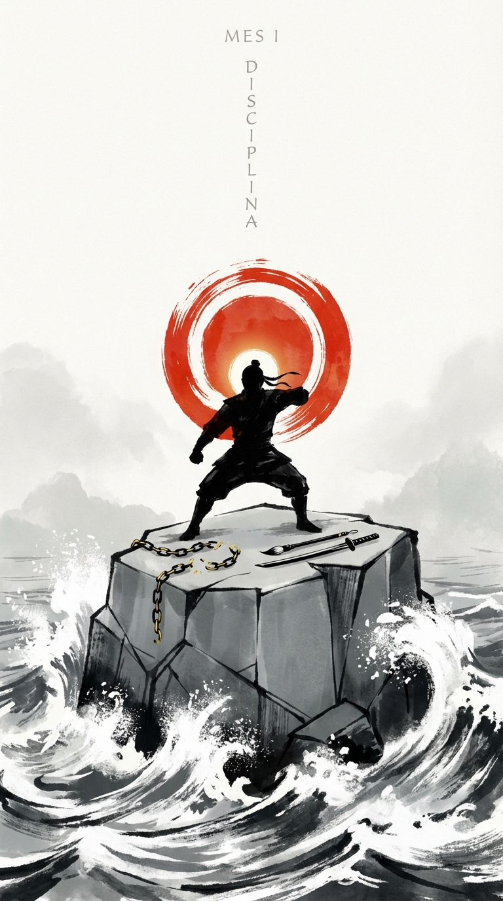

# Introducción al Mes 1: Disciplina (El Cimiento)

> *"No tenemos un cuerpo para toda la vida, tenemos un cuerpo para cada día. Y cada día debemos ganárnoslo."*

Bienvenido al inicio.

Si has abierto este diario, es porque sospechas —o sabes con certeza— que hay una versión de ti mismo más afilada, más capaz y más serena esperando ser liberada. Tal vez eres un artista marcial que busca llevar su práctica más allá del dojo. Tal vez eres un emprendedor, un líder o simplemente alguien que ha decidido dejar de ser un espectador de su propia vida. Sea cual sea tu punto de partida, el camino del guerrero comienza siempre en el mismo lugar: la **Disciplina**.

No es casualidad que este sea el primer mes. No podíamos empezar con la Estrategia, porque la mejor estrategia del mundo es inútil si no tienes la constancia para ejecutarla. No podíamos empezar con el Liderazgo, porque nadie puede gobernar a otros si no es capaz de gobernarse a sí mismo. No podíamos empezar con el Wu-wei (la acción sin esfuerzo), porque la fluidez solo surge después de años de estructura rígida y repetición.

La disciplina es el cimiento. Es la roca sobre la que edificaremos los otros once pilares de este año. Sin ella, todo lo demás es teoría, filosofía de salón, palabras que se lleva el viento.

### ¿Qué es realmente la Disciplina?

Vivimos en una cultura que ha malinterpretado profundamente este concepto. A menudo, vemos la disciplina como un castigo, una restricción, una cárcel autoimpuesta. La asociamos con maestros estrictos, con privaciones, con un "tener que" que nos aplasta el alma.

Pero para el guerrero, la disciplina es exactamente lo contrario: **es la libertad suprema**.

Jocko Willink, ex comandante de los SEALs, lo resume en dos palabras: *"Discipline Equals Freedom"* (La disciplina es igual a la libertad).

Piénsalo.
Si no tienes disciplina financiera, eres esclavo de tus deudas y de tu jefe.
Si no tienes disciplina física, eres esclavo de tu cansancio, de tus dolores y de tu falta de energía.
Si no tienes disciplina emocional, eres esclavo de tus impulsos, de tu ira y de las provocaciones de los demás.
Si no tienes disciplina mental, eres esclavo de la distracción, del algoritmo de las redes sociales y de la ansiedad.

Solo a través de la disciplina ganamos la capacidad de elegir. La disciplina es la herramienta que corta las cadenas de nuestros caprichos momentáneos para permitirnos perseguir lo que realmente queremos a largo plazo. No es una jaula; es la llave.

### La Mentira de la Motivación

Uno de los errores más comunes al iniciar cualquier camino es depender de la motivación.
"Hoy me siento motivado, voy a entrenar duro".
"Hoy no tengo ganas, lo haré mañana".

La motivación es una emoción. Y como todas las emociones, es voluble, efímera y traicionera. Depende de si has dormido bien, de si hace sol, de si te han dado una buena noticia o de si has tomado suficiente café. Construir tu vida sobre la motivación es construir una casa sobre arena movediza.

El guerrero sabe que la motivación es un extra, un regalo ocasional, pero nunca el motor principal. La disciplina, en cambio, es constante. La disciplina es lo que queda cuando la motivación se ha ido. Es la capacidad de hacer lo que tienes que hacer, cuando tienes que hacerlo, te guste o no. Especialmente cuando no te gusta.

Mike Tyson lo dijo con una claridad brutal: *"La disciplina es hacer lo que odias hacer, pero hacerlo como si lo amaras".*

Este mes no buscaremos sentirnos bien. Buscaremos **hacerlo bien**. Entrenaremos la capacidad de actuar independientemente de nuestro estado interno. Separaremos la acción del sentimiento. Porque la acción genera el sentimiento, y no al revés.

### Los Cuatro Pilares de la Disciplina Marcial

Durante las próximas cuatro semanas, desglosaremos la disciplina en cuatro dimensiones prácticas:

**1. La Rutina como Ancla (Semana 1)**
El caos es el enemigo. En el combate, el caos te mata. En la vida, el caos te dispersa. La primera semana nos centraremos en establecer rituales innegociables. No se trata de tener una rutina perfecta de 5 a 9 de la mañana como un gurú de productividad de Instagram. Se trata de tener puntos de anclaje: un momento para levantarse, un momento para entrenar, un momento para reflexionar. La estructura libera a la mente de la fatiga de decisión.

**2. Resistencia a la Incomodidad (Semana 2)**
La comodidad es una droga de diseño lento. Nos debilita sin que nos demos cuenta. En la segunda semana, buscaremos deliberadamente la incomodidad. El frío, el esfuerzo físico, la conversación difícil. Aprenderemos a ver la fricción no como una señal para detenernos, sino como una señal de que estamos creciendo. Como dicen los estoicos: *"La dificultad es lo que despierta al genio"*.

**3. El Detalle y la Precisión (Semana 3)**
La disciplina no es solo fuerza bruta; es atención. Es hacer la cama con las esquinas perfectas. Es limpiar el tatami con reverencia. Es revisar el correo antes de enviarlo. Es la diferencia entre un movimiento tosco y un movimiento maestro. En la tercera semana, bajaremos la velocidad para aumentar la calidad. Entenderemos que cómo hacemos una cosa es cómo hacemos todo.

**4. Constancia bajo Presión (Semana 4)**
Es fácil ser disciplinado cuando todo va bien. El verdadero examen llega cuando la vida te golpea. Cuando estás enfermo, cuando tienes problemas en el trabajo, cuando estás triste. Ahí es donde se forja el carácter. La cuarta semana nos preparará para mantener el rumbo en medio de la tormenta.

### Cómo usar este mes

No intentes ser perfecto. La perfección es enemiga de la ejecución.
Este mes fallarás. Te saltarás un día. Te levantarás tarde. Comerás lo que no debes.
No importa.
La disciplina no es no caerse nunca. La disciplina es reducir el tiempo que tardas en levantarte.
Si fallas un día, no esperes al lunes siguiente para "empezar de nuevo". Empieza en la siguiente comida. Empieza en la siguiente hora. Empieza en la siguiente respiración.

El objetivo de este mes es simple: demostrarte a ti mismo que puedes confiar en tu propia palabra.
Cuando dices "voy a hacer esto", lo haces.
Esa autoconfianza es el verdadero superpoder del guerrero. Es la base de la autoestima. No puedes quererte a ti mismo si sabes que no puedes contar contigo mismo.

Así que, bienvenido al cimiento.
Va a ser duro.
Va a ser incómodo.
Y va a valer la pena cada segundo.

Hunde tus barcos. No hay vuelta atrás.
Empezamos.
