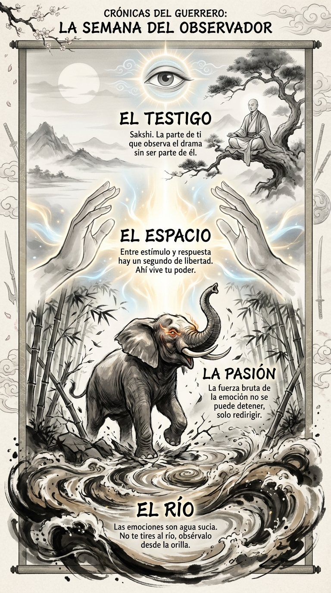

# 07 Febrero: Resumen Semana 6 - El Observador

> *"No eres tus pensamientos. Eres el espacio donde ocurren tus pensamientos."*

### Síntesis Visual
Esta semana hemos trabajado la disociación entre el estímulo y la respuesta. La infografía muestra la lucha interna entre la pasión animal (el elefante/río) y la consciencia superior (el testigo).
*   **El Río:** Representa el flujo constante y a veces sucio de nuestras emociones automáticas.
*   **El Elefante:** La fuerza bruta de los impulsos que no podemos detener, solo observar.
*   **El Espacio:** La pausa sagrada de 3 segundos que nos devuelve la libertad.

### Puntos Clave
1.  **Dicotomía del Control:** Solo controlas tu juicio, no el evento externo.
2.  **El Observador:** Aprender a mirar la emoción sin ser la emoción.
3.  **Silencio:** El vacío fértil donde nace la respuesta correcta.

### Pregunta de Reflexión
¿Cuántas veces esta semana has logrado detenerte en "El Espacio" antes de reaccionar?
