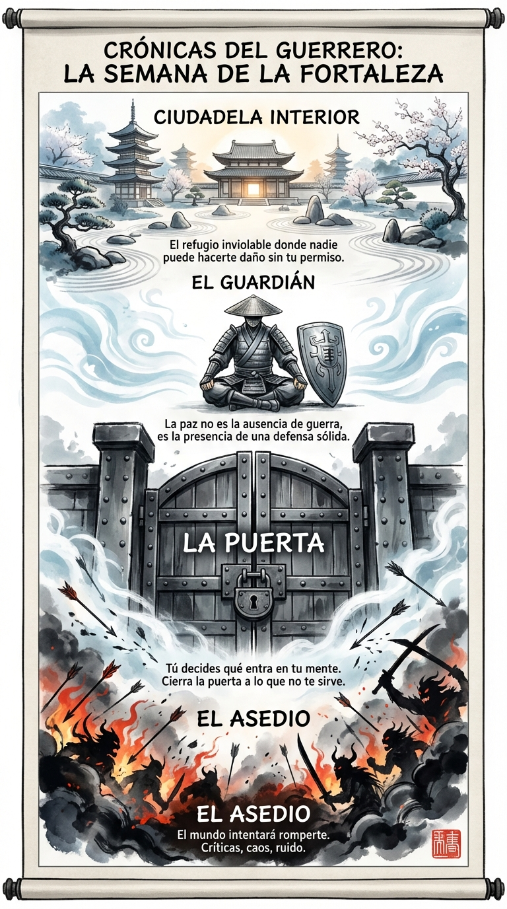

# 14 Febrero: Resumen Semana 7 - La Fortaleza

> *"La mente invencible es aquella que no se deja conquistar por nada externo."*

### Síntesis Visual
La imagen de esta semana se centra en la "Ciudadela Interior".
*   **El Asedio:** El caos del mundo exterior intentando entrar.
*   **La Puerta:** Tu capacidad de veto. Tú decides qué impresiones entran en tu mente.
*   **El Guardián:** La vigilancia constante (Prosochê) que mantiene la paz interior.

### Puntos Clave
1.  **La Ciudadela:** Tienes un refugio interior que es inviolable si tú no abres la puerta.
2.  **El Asedio:** El mundo siempre atacará. Tu paz depende de tu defensa, no de la ausencia de ataques.
3.  **Vigilancia:** Un guerrero nunca baja la guardia sobre sus propios pensamientos.

### Pregunta de Reflexión
¿Qué "enemigo" (pensamiento o impresión) has dejado entrar en tu ciudadela esta semana que deberías haber detenido en la puerta?
