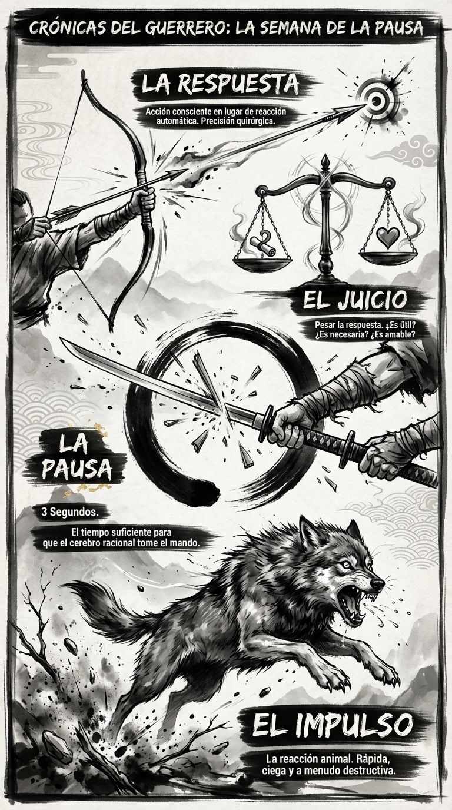

# 21 Febrero: Resumen Semana 8 - La Pausa

> *"La paciencia no es pasividad; es fuerza contenida."*

### Síntesis Visual
Representamos el momento de "Bullet Time" donde el tiempo se detiene para permitir la elección.
*   **El Impulso:** La reacción rápida y peligrosa.
*   **La Pausa:** El acto de voluntad que congela la acción.
*   **La Balanza:** El juicio racional que pesa las consecuencias antes de actuar.

### Puntos Clave
1.  **3 Segundos:** La herramienta táctica más simple y poderosa.
2.  **Inteligencia Emocional:** Sentir la emoción no obliga a actuar sobre ella.
3.  **Respuesta vs Reacción:** La reacción es esclava del pasado; la respuesta crea el futuro.

### Pregunta de Reflexión
¿En qué momento específico esta semana la "Pausa" te salvó de un error?
