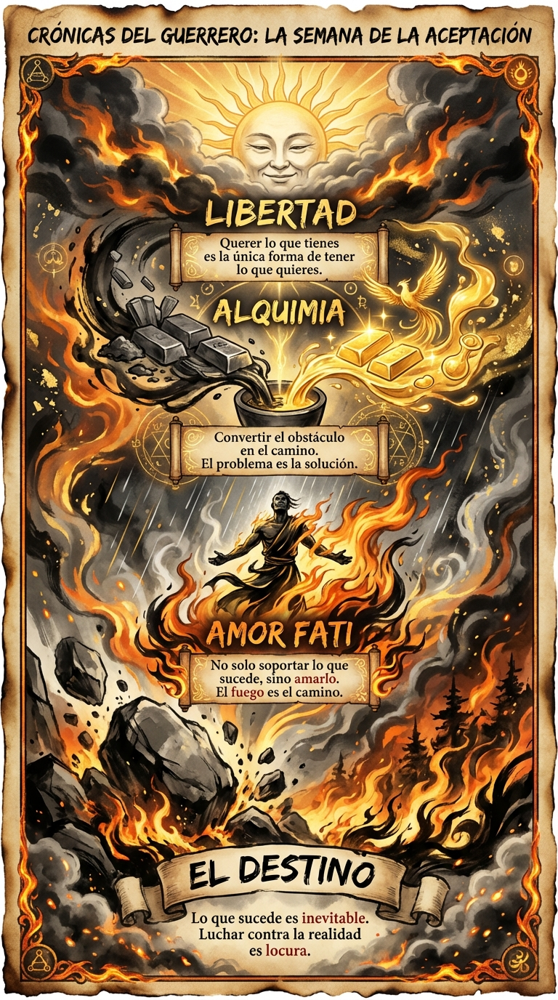

# 28 Febrero: Resumen Semana 9 - Amor Fati

> *"No busques que lo que sucede suceda como quieres, sino quiere que lo que sucede suceda como sucede, y serás feliz."*

### Síntesis Visual
La alquimia final del autocontrol: amar lo que no podemos cambiar.
*   **El Fuego:** El destino, a veces destructor, siempre transformador.
*   **El Abrazo:** La aceptación radical. No resignación, sino bienvenida.
*   **El Oro:** La sabiduría que surge de aceptar la realidad tal como es.

### Puntos Clave
1.  **Aceptación Radical:** Pelear con la realidad es la única forma de perder el 100% de las veces.
2.  **Amor Fati:** Amar el destino. Usar todo lo que pasa como combustible.
3.  **Libertad:** La libertad no es cambiar el mundo, es cambiar tu deseo sobre el mundo.

### Pregunta de Reflexión
¿Qué circunstancia difícil de este mes has logrado no solo aceptar, sino abrazar?
