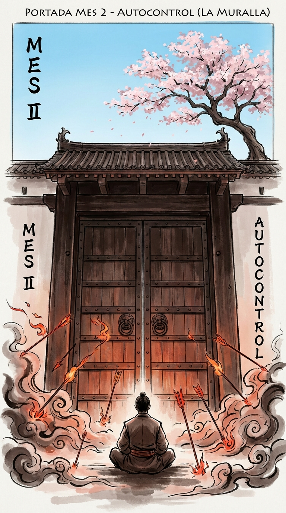

# Introducción al Mes 2: Autocontrol (La Muralla)

> *"Quien conquista a otros es fuerte; quien se conquista a sí mismo es poderoso."*
> — **Lao-Tse**, *Tao Te King*

Si Enero fue el mes de la **Acción** (hacer lo que debes hacer), Febrero es el mes de la **Reacción** (no hacer lo que no debes hacer).

La disciplina es el motor que te impulsa hacia adelante. El autocontrol es el volante y los frenos que te mantienen en la carretera. Sin disciplina, no arrancas. Sin autocontrol, te estrellas en la primera curva.

Vivimos en una sociedad diseñada para destruir tu autocontrol.
*   Los algoritmos de redes sociales están diseñados por los mejores ingenieros del mundo para secuestrar tu dopamina.
*   La industria alimentaria diseña productos "hiperpalatables" para anular tu señal de saciedad.
*   Las noticias están diseñadas para provocar indignación y miedo, porque eso vende clics.
*   La cultura moderna te dice: "Si lo sientes, hazlo". "No te reprimas". "Te lo mereces".

El guerrero rechaza esta esclavitud.
El guerrero entiende que la verdadera libertad no es hacer lo que te apetece en cada momento (eso es esclavitud a los impulsos). La verdadera libertad es la capacidad de elegir tu respuesta ante cualquier estímulo.

Si alguien te insulta y te enfadas automáticamente, eres un esclavo de ese insulto.
Si ves un pastel y te lo comes automáticamente, eres un esclavo del azúcar.
Si suena el móvil y lo miras automáticamente, eres un esclavo de la notificación.

Este mes vamos a construir tu **Ciudadela Interior**.
Es un concepto estoico: un refugio dentro de tu mente que es inexpugnable. El mundo exterior puede estar en llamas, pueden quitarte tus posesiones, pueden insultarte, pueden herirte físicamente... pero nadie puede entrar en tu ciudadela sin tu permiso. Nadie puede obligarte a sentirte ofendido, triste o derrotado. Eso es una elección tuya.

### El Mapa del Mes

Este mes trabajaremos en cuatro dimensiones del autocontrol:

1.  **Semana 1: La Pausa Sagrada.** Aprenderemos a insertar un espacio vital entre el estímulo y la respuesta. Dejaremos de ser reactivos para ser proactivos.
2.  **Semana 2: La Gestión de la Ira.** La ira es una energía nuclear. Si explota dentro, te destruye. Si se canaliza, mueve montañas. Aprenderemos a no tomarnos nada personalmente.
3.  **Semana 3: Deseo y Dopamina.** Recuperaremos el control sobre nuestros apetitos. Haremos ayunos de dopamina y aprenderemos a disfrutar de la dificultad.
4.  **Semana 4: La Ciudadela Interior.** Construiremos una paz mental que no dependa de que "todo vaya bien". Aprenderemos a estar bien incluso cuando todo va mal.

### Tu Compromiso

Este mes va a ser incómodo. Te pediré que te calles cuando quieras gritar. Te pediré que esperes cuando quieras consumir. Te pediré que observes tu dolor sin anestesiarlo con distracciones.

Pero al otro lado de esa incomodidad está el superpoder más grande que existe: la soberanía sobre ti mismo.
Cuando tú te controlas, nadie te controla.

Bienvenido a la Fortaleza.
