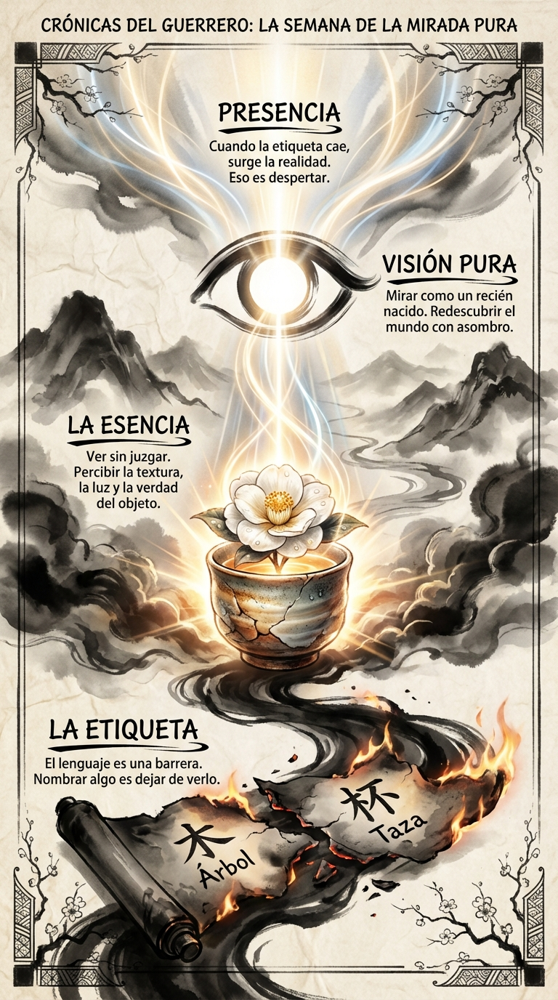

# 07 Marzo: Resumen Semana 10 - La Mirada Pura

> *"El nombre es el invitado, la realidad es el anfitrión."*

### Síntesis Visual
Esta semana hemos practicado el arte de ver sin nombrar.
*   **La Etiqueta:** El lenguaje que cubre la realidad.
*   **El Objeto:** La cosa en sí misma, brillando cuando le quitamos el nombre.
*   **El Ojo:** La percepción directa, sin filtros mentales.

### Puntos Clave
1.  **Suspensión del Juicio:** Ver algo como si fuera la primera vez.
2.  **Textura de la Realidad:** El mundo es más rico de lo que tu vocabulario permite.
3.  **Silencio Mental:** Callar la voz que narra para dejar hablar a la vista.

### Pregunta de Reflexión
¿Qué objeto o persona has mirado hoy realmente, sin darlo por sentado?
