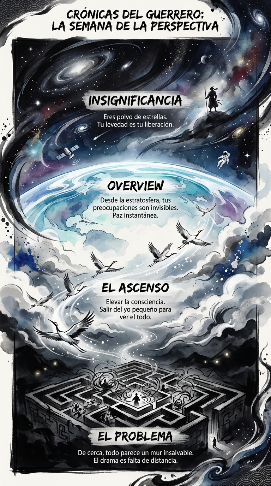

# 14 Marzo: Resumen Semana 11 - La Perspectiva

> *"Desde la luna, no se ven fronteras."*

### Síntesis Visual
La práctica del "Overview Effect" o Visión de Pájaro.
*   **El Laberinto:** Tu vida vista desde el suelo (confusión, muros).
*   **El Ascenso:** La salida vertical hacia una consciencia mayor.
*   **La Tierra:** La paz que da la insignificancia cósmica.

### Puntos Clave
1.  **Zoom Out:** Cuando un problema te ahogue, aléjate.
2.  **Insignificancia:** No eres el centro del universo, y eso es una buena noticia.
3.  **Conexión:** Desde arriba, todos somos parte del mismo organismo.

### Pregunta de Reflexión
¿Qué problema que te preocupaba el lunes parece ridículo visto desde la estratosfera?
