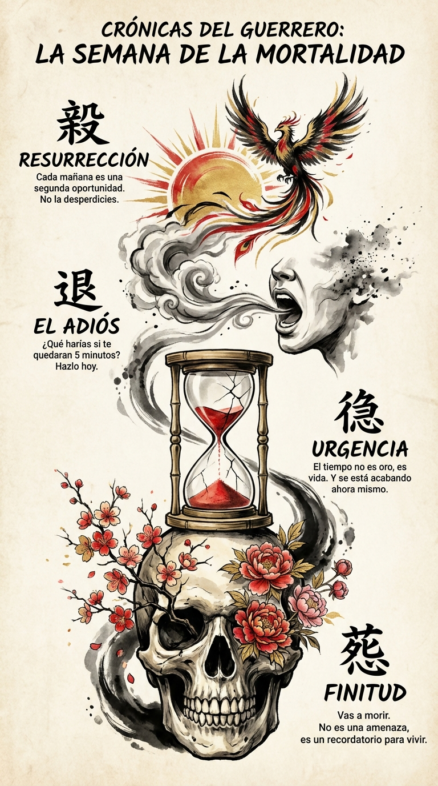

# 21 Marzo: Resumen Semana 12 - Memento Mori

> *"Podrías dejar la vida ahora mismo. Deja que eso determine lo que haces, dices y piensas."* — Marco Aurelio

### Síntesis Visual
La meditación sobre la muerte como motor de vida.
*   **La Calavera:** La verdad ineludible de nuestra finitud.
*   **El Reloj:** La urgencia del tiempo restante.
*   **El Renacer:** La segunda oportunidad que es cada amanecer.

### Puntos Clave
1.  **Finitud:** Saber que el tiempo se acaba te obliga a priorizar.
2.  **Claridad:** La muerte destruye la tontería y deja solo lo esencial.
3.  **Gratitud:** Estar vivo hoy es un accidente estadístico milagroso.

### Pregunta de Reflexión
Si hoy fuera tu último día, ¿estarías haciendo lo que vas a hacer?
