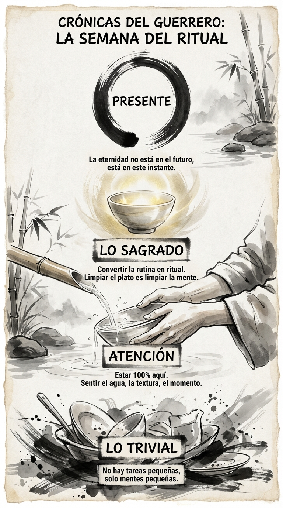

# 28 Marzo: Resumen Semana 13 - El Ritual

> *"Antes de la iluminación, cortar leña y llevar agua. Después de la iluminación, cortar leña y llevar agua."*

### Síntesis Visual
La sacralización de lo cotidiano a través de la atención plena.
*   **Lo Trivial:** Las tareas que despreciamos (fregar, limpiar).
*   **La Atención:** El oro que transforma el plomo en luz.
*   **El Círculo Zen:** La perfección de estar totalmente presente en una sola cosa.

### Puntos Clave
1.  **No hay tareas pequeñas:** Solo hay falta de atención.
2.  **Mindfulness en Acción:** Meditar no es solo sentarse, es vivir despierto.
3.  **El Fin del Aburrimiento:** Cuando prestas atención, todo es fascinante.

### Pregunta de Reflexión
¿Qué tarea "aburrida" vas a convertir hoy en tu ritual sagrado?
