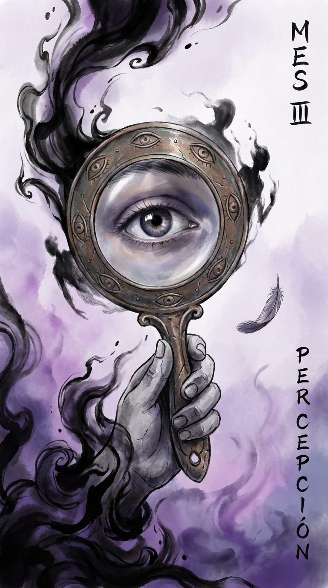

# Introducción al Mes 3: Percepción (El Espejo)

> *"No vemos las cosas como son, las vemos como somos."*
> — **Anaïs Nin**

Has conquistado la **Disciplina** (Enero) para actuar.
Has construido el **Autocontrol** (Febrero) para resistir.
Ahora, en Marzo, debes aprender a **Ver**.

La mayoría de tus problemas no son problemas reales; son problemas de percepción.
*   Ves un obstáculo donde hay una oportunidad.
*   Ves un ataque donde hay una crítica constructiva.
*   Ves un fracaso donde hay un aprendizaje.
*   Ves miedo donde solo hay incertidumbre.

Tu mente es una fábrica de historias. Constantemente recibe datos crudos de la realidad y los procesa a través de tus filtros: tus creencias, tus traumas, tu ego, tu cultura. Lo que sale al final no es la Verdad, es *tu* versión de la verdad. Y a menudo, esa versión está distorsionada y te hace débil.

El guerrero sabe que la claridad es poder.
Si estás en una batalla y tu mapa está mal, no importa lo rápido que corras (disciplina) o lo valiente que seas (autocontrol); vas a perder. Necesitas el mapa correcto.

Este mes vamos a limpiar tus lentes. Vamos a aprender a separar los hechos de los juicios.
Vamos a estudiar cómo los grandes estrategas, científicos y filósofos han entrenado sus mentes para ver lo que otros ignoran.

### El Mapa del Mes

1.  **Semana 1: El Arte de Ver.** Descubriremos cómo nuestros sesgos cognitivos nos ciegan y cómo adoptar la "mente de principiante".
2.  **Semana 2: Reencuadre (Reframing).** Aprenderemos la habilidad mágica de cambiar el significado de cualquier evento. Convertiremos obstáculos en caminos.
3.  **Semana 3: La Verdad Incómoda.** Nos enfrentaremos a las realidades duras que preferimos ignorar (como la muerte y nuestra propia ignorancia) para ganar libertad.
4.  **Semana 4: Foco y Atención.** En un mundo de distracción infinita, la atención dirigida es el recurso más escaso. Aprenderemos a protegerla.

### Tu Compromiso

Este mes te dolerá el ego. Tendrás que admitir que muchas de tus "verdades absolutas" son solo opiniones. Tendrás que cuestionar tus propias narrativas de víctima.
Pero la recompensa es la cordura.
Cuando ves la realidad con claridad, el miedo desaparece. El miedo vive en la oscuridad de lo desconocido o lo mal interpretado. Cuando enciendes la luz, solo queda lo que hay. Y con lo que hay, siempre se puede lidiar.

Abre los ojos.
