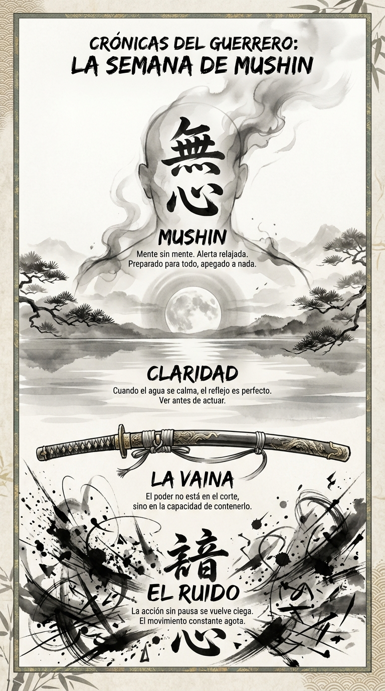

# 07 Abril: Resumen Semana 14 - Mushin

> *"El guerrero actúa y el tonto habla de actuar."*

### Síntesis Visual
La transición del frenesí a la calma absoluta.
*   **El Ruido:** La acción descontrolada que agota.
*   **La Vaina:** La contención del poder.
*   **Mushin:** La mente vacía que refleja la realidad perfectamente.

### Puntos Clave
1.  **Silencio Táctico:** Parar no es rendirse, es afilar la espada.
2.  **Claridad:** Solo en aguas tranquilas puedes ver el fondo.
3.  **Acción vs Movimiento:** Moverse mucho no es avanzar. Actuar requiere dirección.

### Pregunta de Reflexión
¿Tu semana ha sido acción consciente o solo ruido y movimiento?
