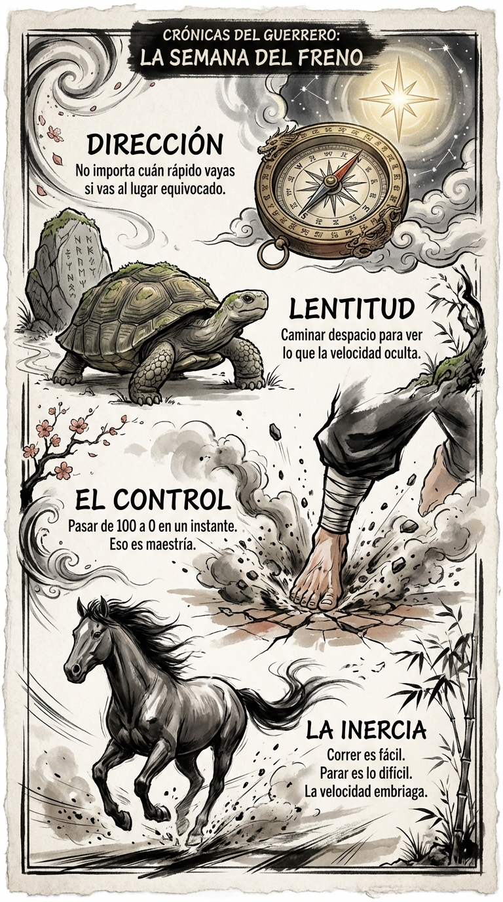

# 14 Abril: Resumen Semana 15 - El Freno

> *"La velocidad es irrelevante si vas en la dirección equivocada."*

### Síntesis Visual
El control absoluto sobre la propia velocidad.
*   **La Inercia:** La adicción a la prisa.
*   **El Freno:** La capacidad de detenerse en seco.
*   **La Brújula:** Recalibrar la dirección antes de volver a acelerar.

### Puntos Clave
1.  **100 a 0:** La maestría es poder parar instantáneamente.
2.  **Lentitud Deliberada:** Caminar despacio para ver lo que la velocidad oculta.
3.  **Dirección:** Más vale un paso en la dirección correcta que mil en la incorrecta.

### Pregunta de Reflexión
¿Has corrido esta semana hacia tu objetivo o simplemente huías del silencio?
