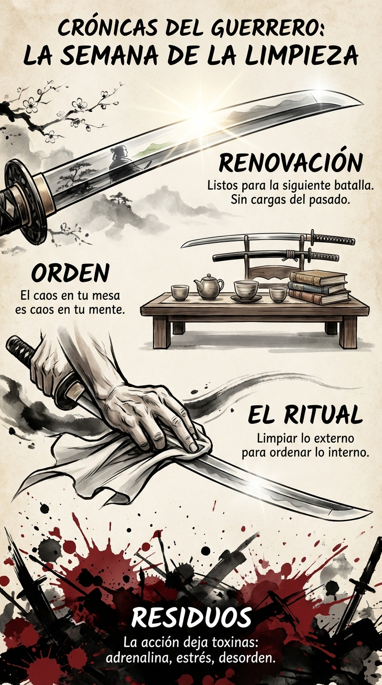

# 28 Abril: Resumen Semana 17 - La Limpieza

> *"En medio del caos, mantén la quietud dentro de ti."*

### Síntesis Visual
El ritual de purificación post-batalla.
*   **Residuos:** Lo que la acción deja atrás (estrés, desorden).
*   **El Ritual:** Limpiar el entorno para ordenar la mente.
*   **Renovación:** Quedar listo para el siguiente asalto.

### Puntos Clave
1.  **Higiene Mental:** No puedes empezar una nueva batalla con la sangre de la anterior.
2.  **Orden Externo:** Tu entorno refleja y afecta tu estado interno.
3.  **Cierre:** Terminar bien es tan importante como empezar bien.

### Pregunta de Reflexión
¿Qué "residuo" mental o físico necesitas limpiar hoy para empezar mayo con fuerza?
