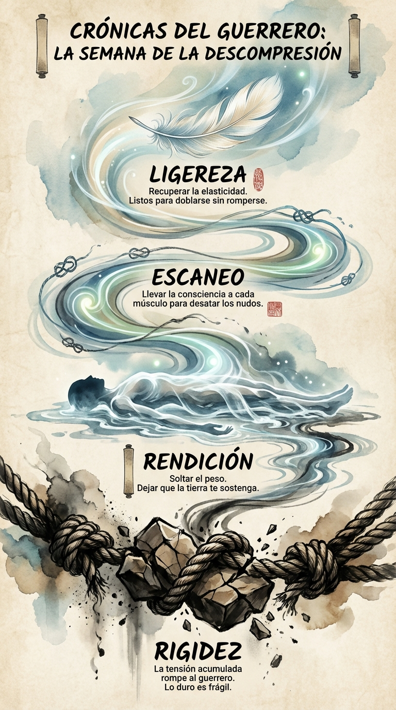

# 07 Mayo: Resumen Semana 18 - La Descompresión

> *"Lo que es flexible perdura. Lo que es rígido se rompe."*

### Síntesis Visual
La liberación de la tensión acumulada.
*   **Rigidez:** El peligro de ser siempre fuerte.
*   **Rendición:** Soltar el peso en la tierra.
*   **Escaneo:** La consciencia líquida que disuelve los nudos.

### Puntos Clave
1.  **Elasticidad:** La verdadera resistencia no es dureza, es recuperación.
2.  **Body Scan:** Tu cuerpo lleva la cuenta de tus batallas. Escúchalo.
3.  **Soltar:** A veces, lo más valiente que puedes hacer es descansar.

### Pregunta de Reflexión
¿Qué parte de tu cuerpo (o de tu vida) está gritando por un poco de suavidad hoy?
