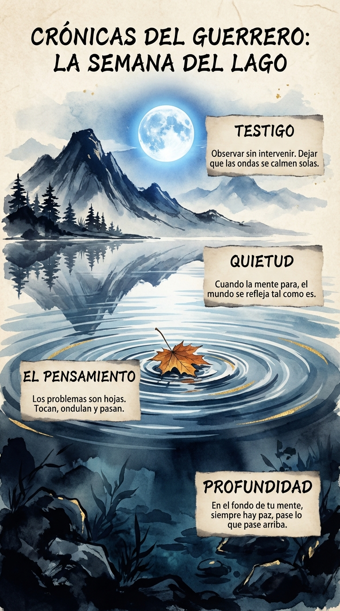

# 14 Mayo: Resumen Semana 19 - El Lago

> *"La mente tranquila es la mejor arma contra los desafíos."*

### Síntesis Visual
La profundidad inalterable de la mente.
*   **El Pensamiento:** Una hoja que crea ondas temporales.
*   **Profundidad:** La paz que reside bajo la superficie agitada.
*   **El Testigo:** Observar la tormenta sin mojarse.

### Puntos Clave
1.  **Superficie vs Fondo:** Tus problemas son olas; tú eres el océano.
2.  **No Intervención:** Deja que el barro se asiente solo.
3.  **Refugio:** Tienes un lugar dentro de ti donde siempre es domingo por la mañana.

### Pregunta de Reflexión
¿Has logrado ver tus problemas como "hojas flotando" o te has ahogado en ellos?
