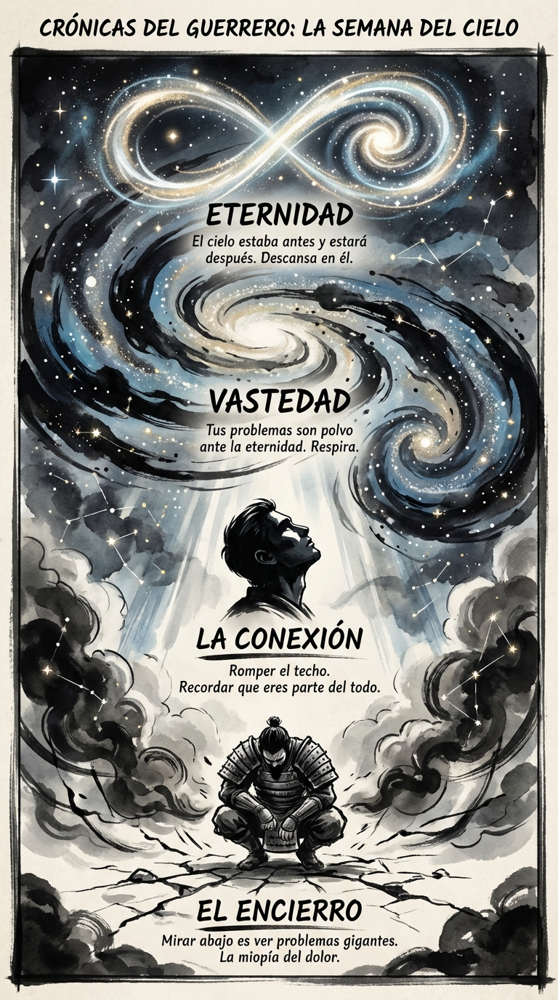

# 21 Mayo: Resumen Semana 20 - El Cielo

> *"Somos polvo de estrellas contemplando las estrellas."*

### Síntesis Visual
La cura para la miopía del dolor: la perspectiva cósmica.
*   **El Encierro:** La visión de túnel que crea el sufrimiento.
*   **La Conexión:** Mirar arriba para recordar quién eres.
*   **Vastedad:** El antídoto contra la importancia personal.

### Puntos Clave
1.  **Sky Gazing:** La terapia más barata y efectiva del mundo.
2.  **Escala:** Tus problemas no son grandes, tú estás mirando demasiado de cerca.
3.  **Pertenencia:** No estás solo; estás en un universo vivo.

### Pregunta de Reflexión
¿Cuándo fue la última vez que te sentiste pequeño (y aliviado por ello)?
