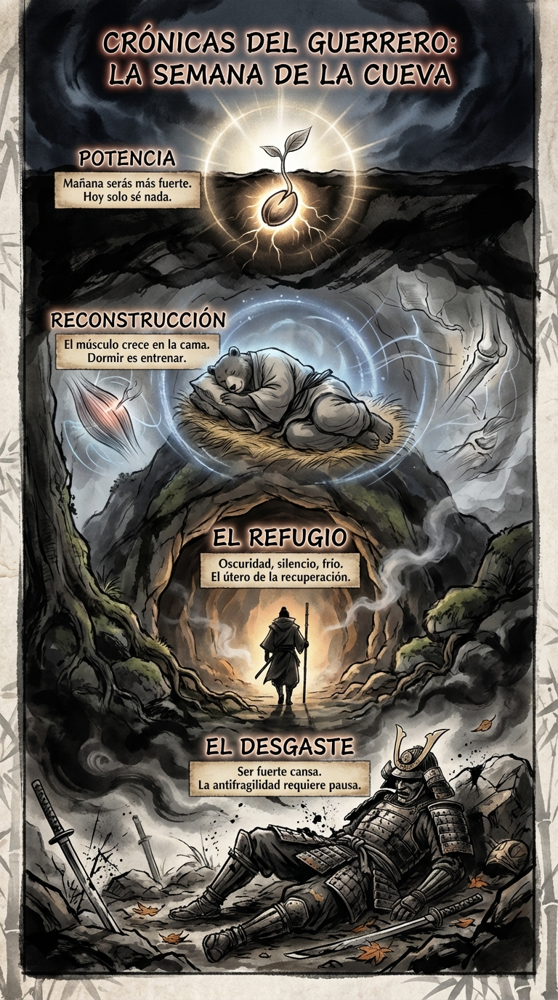

# 28 Mayo: Resumen Semana 21 - La Cueva

> *"El músculo no crece en el gimnasio, crece en la cama."*

### Síntesis Visual
El descanso radical como estrategia de crecimiento.
*   **El Desgaste:** La inevitabilidad del daño tras la batalla.
*   **La Cueva:** El entorno protegido necesario para sanar.
*   **Reconstrucción:** Dormir es el acto más productivo del guerrero.

### Puntos Clave
1.  **Antifragilidad:** Romperse es parte del plan, pero solo si te reparas.
2.  **Sueño Sagrado:** Proteger tu descanso es proteger tu fuerza.
3.  **Ciclos:** No se puede ser verano todo el año; necesitas invierno.

### Pregunta de Reflexión
¿Te has permitido "hibernar" lo suficiente esta semana para crecer?
