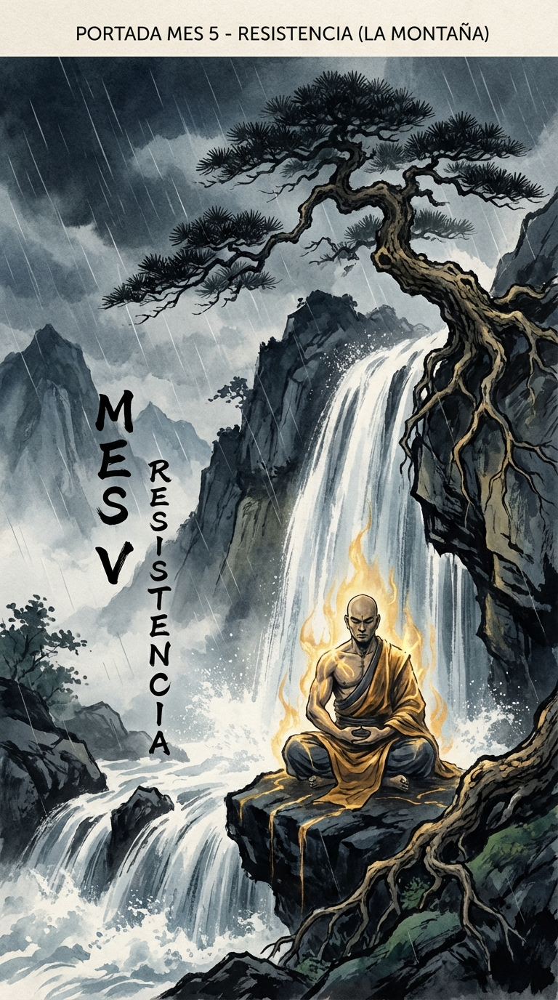

# Introducción al Mes 5: Resistencia (La Montaña)

> *"La resistencia no es solo la capacidad de soportar algo difícil, sino de convertirlo en gloria."*
> — **Friedrich Nietzsche**

En abril, tomaste acción. Te lanzaste al ruedo. Rompiste la inercia y te moviste con audacia.
Y entonces, sucedió lo inevitable: el mundo te golpeó de vuelta.

Es una ley física: a toda acción se opone una reacción igual y de sentido contrario. En la vida, esa reacción se llama **Resistencia**.
Puede tomar muchas formas: fracaso, rechazo, dolor físico, agotamiento mental, crítica, o simplemente la inmensa y pesada monotonía del esfuerzo diario.

Muchos guerreros caen aquí. Tienen la disciplina para empezar (Enero), el autocontrol para prepararse (Febrero), la claridad para ver el objetivo (Marzo) y el coraje para actuar (Abril). Pero cuando la batalla se alarga, cuando el entusiasmo inicial se evapora y solo queda el sufrimiento, se quiebran.

Mayo está dedicado a lo que sucede después del primer golpe. Está dedicado al **Aguante**.

La resistencia no es pasividad. No es simplemente "soportar" como un saco de boxeo. Es una virtud activa. Es la capacidad de mantener la estructura, la moral y el propósito bajo una presión aplastante. Es la cualidad que separa a los amateurs de los profesionales, a los soñadores de los realizadores.

### Las 4 Dimensiones de la Resistencia

Este mes construiremos una armadura para tu voluntad:

1.  **El Cuerpo (Semana 1):** La mente no puede ser fuerte si el vehículo es débil. Exploraremos la resistencia física con Emil Zátopek y los Samurai, aprendiendo a usar el dolor como información, no como señal de parada.
2.  **La Mente (Semana 2):** El cuerpo puede aguantar casi cualquier cosa; es la mente la que se rinde primero. Estudiaremos cómo Nelson Mandela y Viktor Frankl mantuvieron su libertad interior en las prisiones más oscuras.
3.  **El Espíritu (Semana 3):** Cuando la lógica dice "ríndete", el espíritu dice "sigue". La fe (en uno mismo, en una causa, en un dios) es el combustible final. Juana de Arco y Gandhi nos enseñarán el poder de una convicción inquebrantable.
4.  **Antifragilidad (Semana 4):** El nivel más alto de resistencia. No solo aguantar el golpe, sino fortalecerse con él. Como la Hidra o el Fénix, aprenderemos a usar el caos y el fracaso como alimento para nuestro crecimiento.

### Tu Misión

Este mes va a doler.
Te pediremos que abraces la incomodidad. Que busques el límite de tus fuerzas y des un paso más.
Porque es en ese lugar, justo donde crees que no puedes más, donde se forja el verdadero carácter.

El acero se templa en el fuego. El guerrero se templa en la dificultad.
Bienvenido al mes de la Resistencia.
