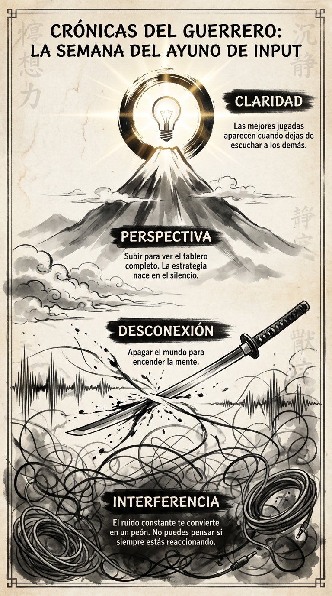

# 07 Junio: Resumen Semana 22 - El Ayuno de Input

> *"El silencio no es la ausencia de sonido, sino la ausencia de ego."*

### Síntesis Visual
La desconexión estratégica para recuperar la claridad.
*   **Interferencia:** El ruido que te impide pensar.
*   **Desconexión:** Cortar los cables para liberar la mente.
*   **Perspectiva:** Subir a la montaña del silencio para ver el tablero.

### Puntos Clave
1.  **Dieta Cognitiva:** Eres lo que consumes. Si comes basura, piensas basura.
2.  **Silencio Fértil:** Las mejores ideas no gritan, susurran.
3.  **Control:** Quien controla tu atención, controla tu vida.

### Pregunta de Reflexión
¿Qué "cable" necesitas cortar hoy para volver a escucharte a ti mismo?
