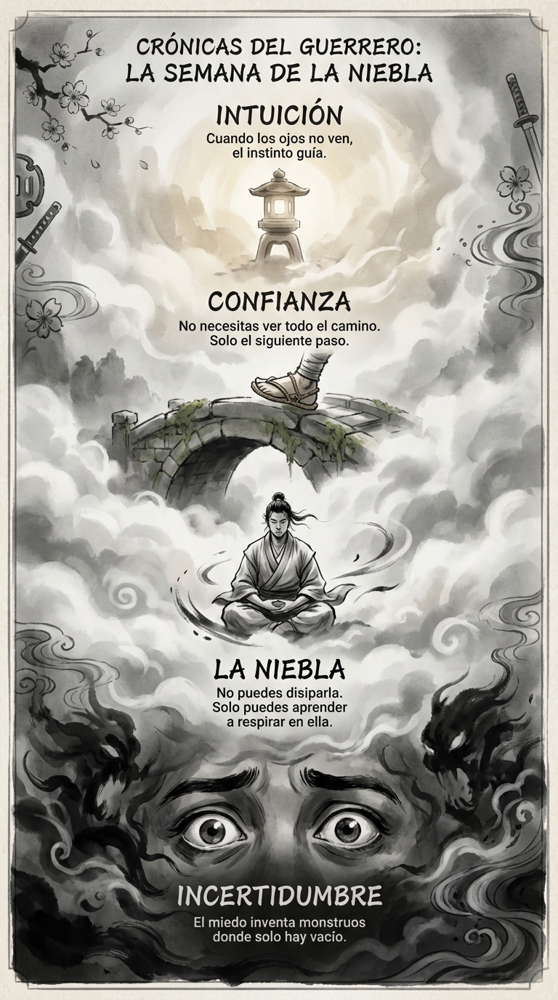

# 14 Junio: Resumen Semana 23 - La Niebla

> *"La incertidumbre es el refugio de la esperanza."*

### Síntesis Visual
Navegar lo desconocido con calma.
*   **Incertidumbre:** El miedo a lo que no se ve.
*   **La Niebla:** La realidad inevitable de la vida.
*   **Confianza:** Saber que el siguiente paso aparecerá cuando lo des.

### Puntos Clave
1.  **Aceptación:** No luches contra la niebla, aprende a caminar en ella.
2.  **Miopía Táctica:** No necesitas ver el final del camino, solo el próximo metro.
3.  **Calma:** El pánico es más peligroso que la ignorancia.

### Pregunta de Reflexión
¿Qué es lo que "no sabes" ahora mismo y puedes aceptar no saber?
