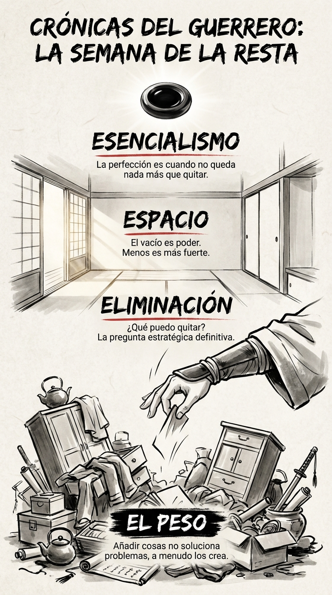

# 21 Junio: Resumen Semana 24 - La Resta

> *"La perfección no se alcanza cuando no hay nada más que añadir, sino cuando no hay nada más que quitar."*

### Síntesis Visual
La estrategia de la eliminación.
*   **El Peso:** Todo lo que sobra y estorba.
*   **Eliminación:** El acto valiente de decir "no".
*   **Espacio:** El vacío donde la energía fluye libremente.

### Puntos Clave
1.  **Vía Negativa:** A menudo, la solución es dejar de hacer algo.
2.  **Esencialismo:** Menos pero mejor.
3.  **Libertad:** Cada cosa que posees (o haces) te posee a ti.

### Pregunta de Reflexión
¿Qué mueble viejo vas a sacar hoy de la habitación de tu vida?
