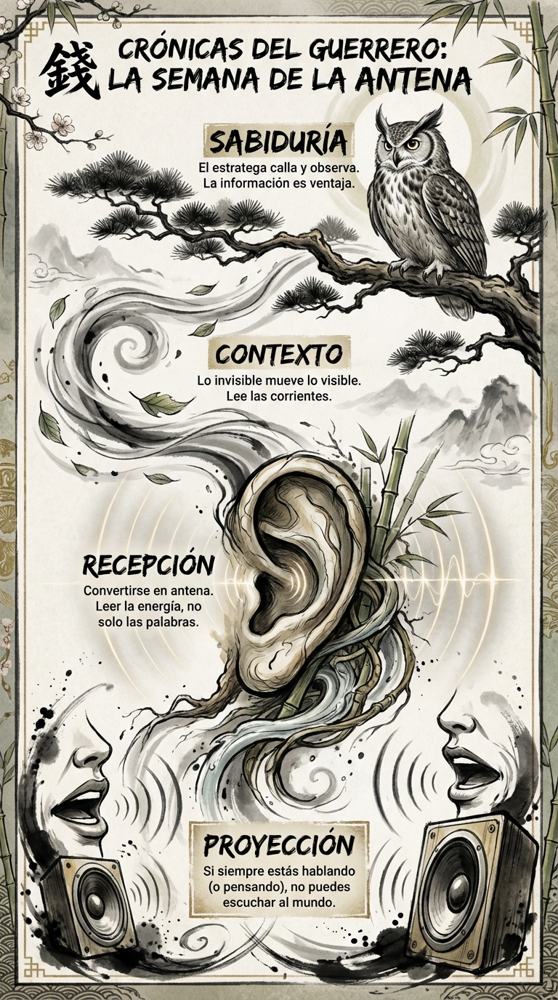

# 28 Junio: Resumen Semana 25 - La Antena

> *"El estratega es un observador voraz."*

### Síntesis Visual
El silencio receptivo para leer el contexto.
*   **Proyección:** El error de hablar más que escuchar.
*   **Recepción:** Abrirse a la información del entorno.
*   **Sabiduría:** Entender el viento antes de izar la vela.

### Puntos Clave
1.  **Escucha Activa:** Oír no es escuchar. Escuchar requiere silencio interior.
2.  **Lectura de Contexto:** La realidad te da pistas si estás atento.
3.  **Humildad:** Asumir que no lo sabes todo es el principio de saber algo.

### Pregunta de Reflexión
¿Cuánto has aprendido hoy escuchando y cuánto has perdido hablando?
