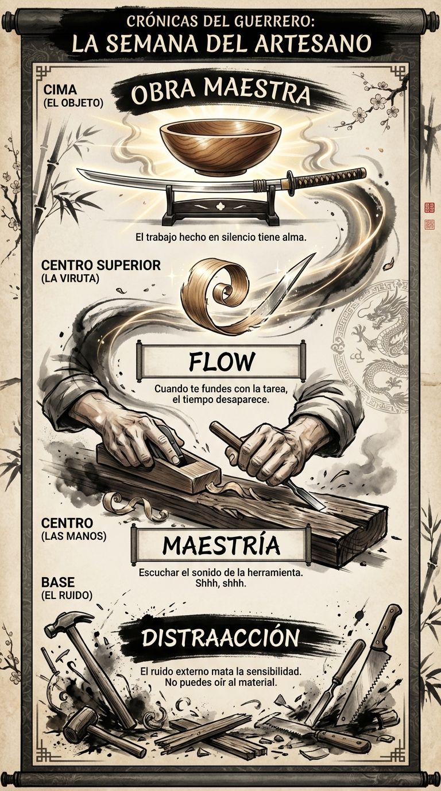

# 07 Julio: Resumen Semana 26 - El Artesano

> *"El silencio es el gran arte de la conversación."*

### Síntesis Visual
La maestría nace en el silencio del taller.
*   **Distracción:** El ruido que te impide conectar con la tarea.
*   **Maestría:** Escuchar lo que el material te pide.
*   **Flow:** Cuando desapareces y solo queda la acción.

### Puntos Clave
1.  **Silencio Externo:** Apaga el mundo para encender tu sensibilidad.
2.  **Escucha Material:** Cada tarea tiene su propia música; aprende a oírla.
3.  **Presencia:** El trabajo bien hecho es una forma de oración.

### Pregunta de Reflexión
¿Has trabajado hoy con ruido o has escuchado la música de tu tarea?
