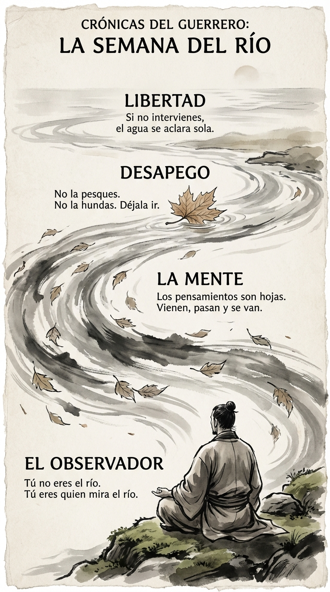

# 14 Julio: Resumen Semana 27 - El Río

> *"El hombre que no sabe estar en silencio no sabe hablar."*

### Síntesis Visual
La gestión del ruido interno.
*   **El Observador:** Tú estás en la orilla, no en el agua.
*   **La Mente:** Un río que arrastra hojas (pensamientos).
*   **Desapego:** No pesques la basura, déjala pasar.

### Puntos Clave
1.  **Disociación:** No eres tus pensamientos.
2.  **No Intervención:** Si no remueves el agua, el barro se asienta solo.
3.  **Paciencia:** Espera en la orilla hasta que el río baje limpio.

### Pregunta de Reflexión
¿Cuántas "hojas" has intentado pescar hoy en lugar de dejarlas ir?
