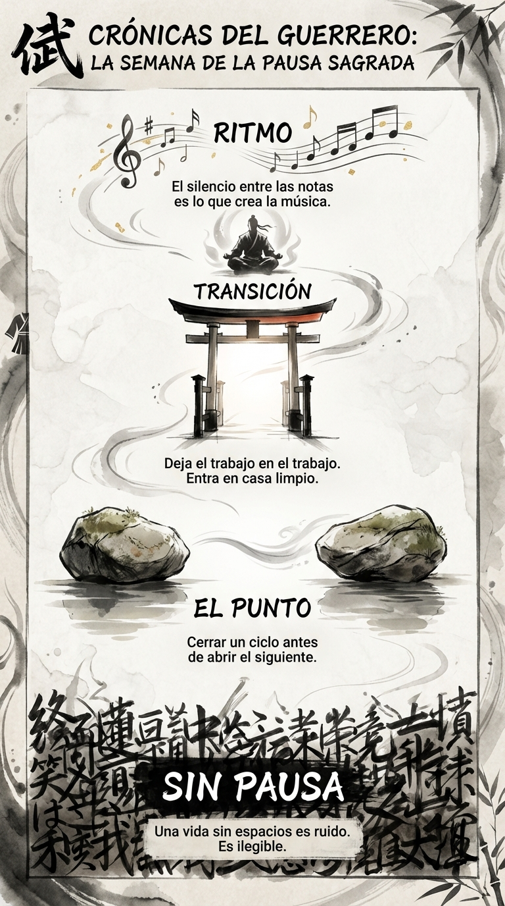

# 28 Julio: Resumen Semana 29 - La Pausa Sagrada

> *"El silencio es más musical que cualquier canción."*

### Síntesis Visual
El ritmo vital creado por los espacios vacíos.
*   **Sin Pausa:** Una vida ilegible por falta de espacios.
*   **El Punto:** Cerrar para poder abrir.
*   **Transición:** Cruzar el umbral limpio.

### Puntos Clave
1.  **Micro-pausas:** No necesitas 20 minutos, necesitas 1 minuto muchas veces.
2.  **Cierre de Ciclos:** No arrastres la energía de una tarea a la siguiente.
3.  **Ritmo:** La vida es música, y la música necesita silencio.

### Pregunta de Reflexión
¿Has puesto algún punto y aparte hoy o ha sido todo una frase interminable?
