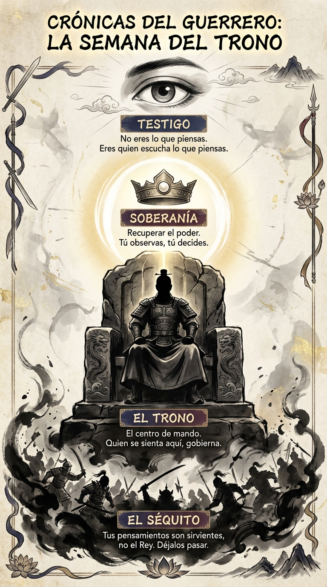

# 07 Agosto: Resumen Semana 30 - El Trono

> *"El silencio es el sueño que nutre la sabiduría."*

### Síntesis Visual
La recuperación de la soberanía mental.
*   **El Séquito:** Pensamientos y emociones que intentan gobernar.
*   **El Trono:** El lugar desde donde observas sin reaccionar.
*   **Soberanía:** Tú eres el Rey, no el sirviente de tu mente.

### Puntos Clave
1.  **Desidentificación:** No eres lo que piensas, eres quien escucha lo que piensas.
2.  **Inmovilidad:** El Rey no corre detrás de los mensajeros.
3.  **Centro:** Mantén tu "postura del trono" ante el caos.

### Pregunta de Reflexión
¿Quién se ha sentado en tu trono hoy: tú o tu ansiedad?
