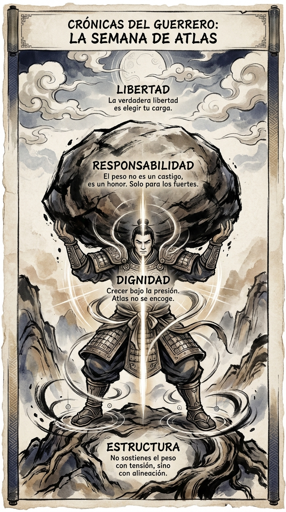

# 14 Agosto: Resumen Semana 31 - Atlas

> *"Atlas no se encogía de hombros."*

### Síntesis Visual
La dignidad de sostener la responsabilidad.
*   **La Carga:** El peso del mundo (tu mundo).
*   **Estructura:** Sostener con los huesos, no con la tensión.
*   **Honor:** La responsabilidad es un privilegio de los fuertes.

### Puntos Clave
1.  **Aceptación del Peso:** No huyas de la carga, alinéate con ella.
2.  **Fuerza Estructural:** La postura correcta hace la carga ligera.
3.  **Liderazgo:** Sostener el mundo sin quejarse es la marca del líder.

### Pregunta de Reflexión
¿Estás sosteniendo tu carga con dignidad o te estás encogiendo bajo ella?
