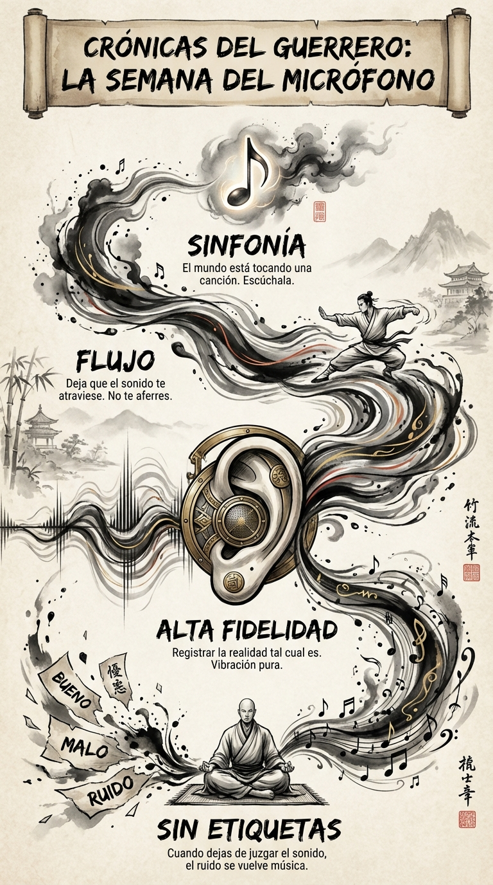

# 21 Agosto: Resumen Semana 32 - El Micrófono

> *"Tenemos dos orejas y una boca para escuchar el doble de lo que hablamos."*

### Síntesis Visual
La escucha radical sin juicio.
*   **Sin Etiquetas:** Oír vibración pura, no "ruido".
*   **Alta Fidelidad:** Registrar la realidad tal cual es.
*   **Sinfonía:** El mundo es música si dejas de juzgarlo.

### Puntos Clave
1.  **Recepción Pura:** Deja que el sonido te atraviese.
2.  **Limpieza de Filtros:** Quita las etiquetas de "bueno" y "malo".
3.  **Presencia:** Escuchar es la forma más profunda de estar aquí.

### Pregunta de Reflexión
¿Qué has escuchado hoy que normalmente habrías ignorado?
