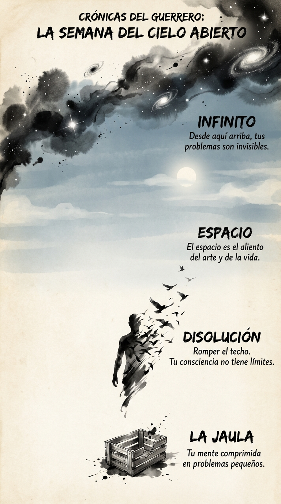

# 28 Agosto: Resumen Semana 33 - Cielo Abierto

> *"El espacio es el aliento del arte."*

### Síntesis Visual
La expansión de la consciencia más allá de los límites.
*   **La Jaula:** La mente pequeña y comprimida.
*   **Disolución:** Romper el techo y fundirse con el cielo.
*   **Infinito:** Tus problemas son polvo desde el espacio.

### Puntos Clave
1.  **Descompresión:** Rompe las paredes mentales.
2.  **Perspectiva Cósmica:** Eres inmenso, no te hagas pequeño.
3.  **Libertad:** El cielo siempre está ahí, incluso si estás en una celda.

### Pregunta de Reflexión
¿Te sientes comprimido hoy o expandido como el cielo?
