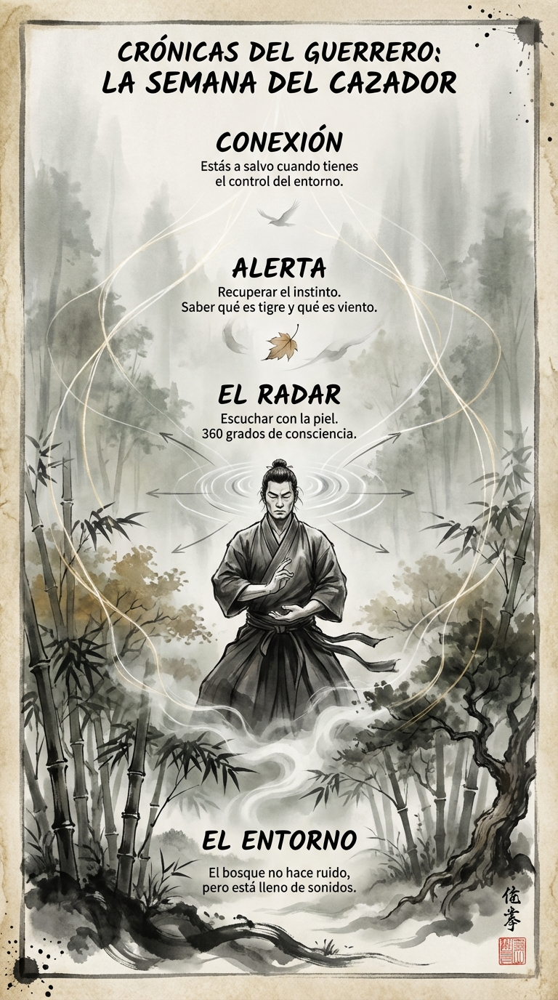

# 07 Septiembre: Resumen Semana 34 - El Cazador

> *"El bosque no hace ruido, pero está lleno de sonidos."*

### Síntesis Visual
La recuperación del instinto auditivo.
*   **El Entorno:** Un mapa de información invisible.
*   **El Radar:** Escuchar esféricamente para sobrevivir.
*   **Alerta:** Saber distinguir la señal del ruido.

### Puntos Clave
1.  **Escucha Activa:** No oigas, escucha.
2.  **Seguridad:** El control del entorno reduce la ansiedad.
3.  **Conexión:** Eres parte del ecosistema, no un turista.

### Pregunta de Reflexión
¿Cuánta información te has perdido hoy por llevar "auriculares mentales"?
