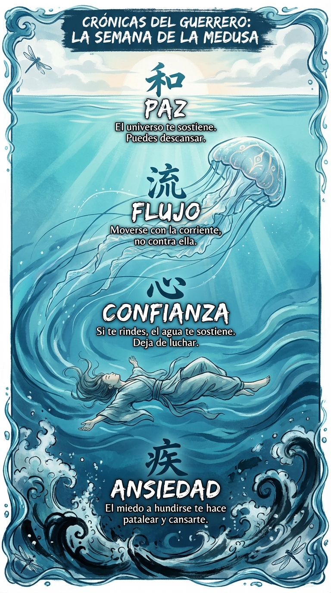

# 14 Septiembre: Resumen Semana 35 - La Medusa

> *"Para aprender a nadar, tienes que dejar de agarrarte al borde."*

### Síntesis Visual
La confianza en la flotabilidad del universo.
*   **Ansiedad:** El pataleo innecesario que te hunde.
*   **Confianza:** Soltar el control y dejar que el agua te sostenga.
*   **Flujo:** Moverse con la corriente requiere menos energía.

### Puntos Clave
1.  **Rendición:** A veces, la mejor acción es no hacer nada.
2.  **Ingravidez:** La tensión es pesada; la relajación flota.
3.  **Fe:** El mundo no se va a caer si tú dejas de sostenerlo un rato.

### Pregunta de Reflexión
¿Estás nadando o estás pataleando para no hundirte?
