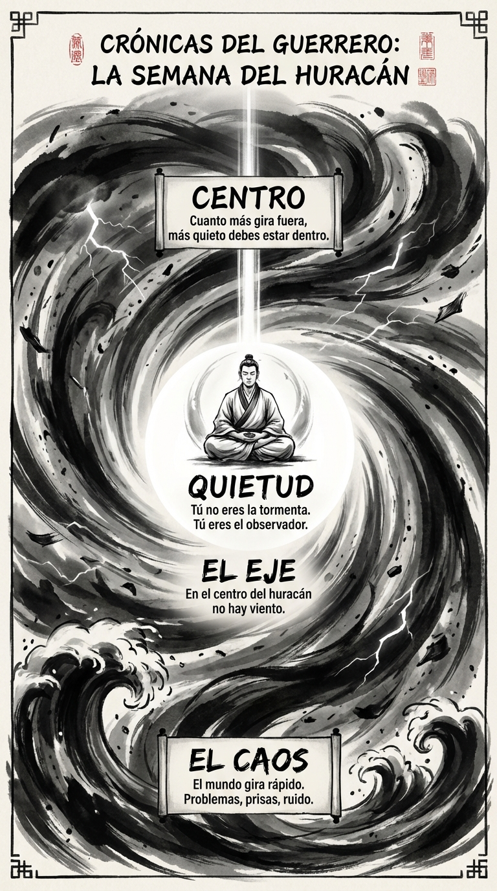

# 21 Septiembre: Resumen Semana 36 - El Huracán

> *"En medio del caos, mantén la quietud dentro de ti."*

### Síntesis Visual
La calma en el centro de la tormenta.
*   **El Caos:** La velocidad inevitable de la vida moderna.
*   **El Eje:** El punto inmóvil donde reside el guerrero.
*   **Quietud:** No intentes parar el viento, sé el centro.

### Puntos Clave
1.  **Centramiento:** Cuanto más rápido gira el mundo, más quieto debes estar tú.
2.  **Observación:** Mira la tormenta sin ser la tormenta.
3.  **Estabilidad:** Tu paz no depende del clima externo.

### Pregunta de Reflexión
¿Estás girando con los escombros o estás sentado en el ojo del huracán?
