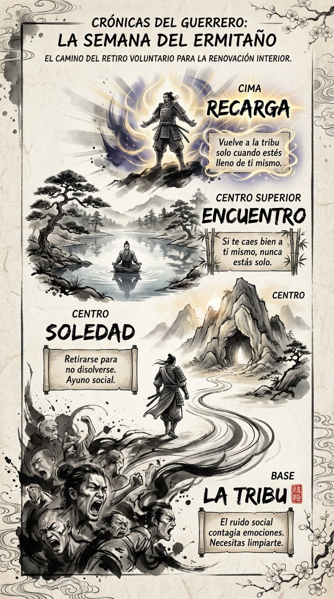

# 28 Septiembre: Resumen Semana 37 - El Ermitaño

> *"La soledad es peligrosa. Es adictiva."*

### Síntesis Visual
El retiro estratégico para la higiene emocional.
*   **La Tribu:** El ruido social que contagia y disuelve.
*   **Soledad:** El espacio necesario para volver a ser tú.
*   **Recarga:** Limpiar el espejo para reflejar tu propia cara.

### Puntos Clave
1.  **Ayuno Social:** Necesitas desintoxicarte de la gente.
2.  **Autosuficiencia:** Si te aburres solo, estás en mala compañía.
3.  **Retorno:** Solo quien sabe irse puede volver con algo que ofrecer.

### Pregunta de Reflexión
¿Cuándo fue la última vez que estuviste verdaderamente solo y en paz?
