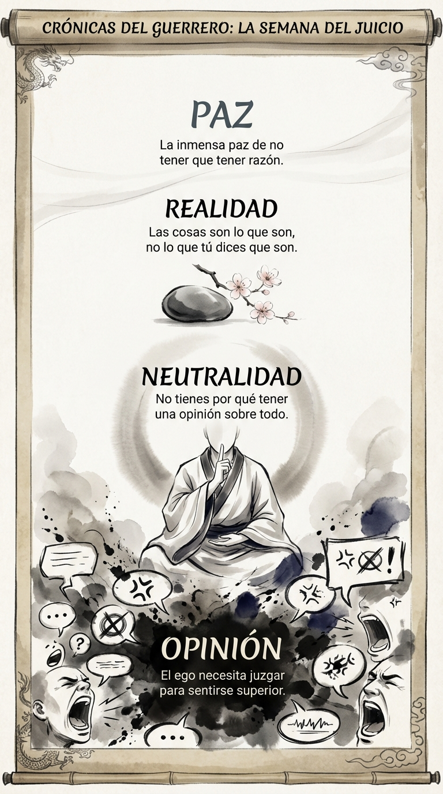

# 07 Octubre: Resumen Semana 38 - El Juicio

> *"No tienes por qué convertir esto en algo."*

### Síntesis Visual
La neutralidad como arma contra el ego.
*   **Opinión:** El ruido constante de juzgarlo todo.
*   **Neutralidad:** El silencio fértil de no etiquetar.
*   **Paz:** La libertad de no tener que tener razón.

### Puntos Clave
1.  **Ayuno de Opinión:** Deja de alimentar al ego con juicios.
2.  **Realidad:** Las cosas son lo que son, no lo que tú dices.
3.  **Silencio:** Si no tienes nada que decir que mejore el silencio, calla.

### Pregunta de Reflexión
¿Cuántas opiniones innecesarias has emitido hoy?
