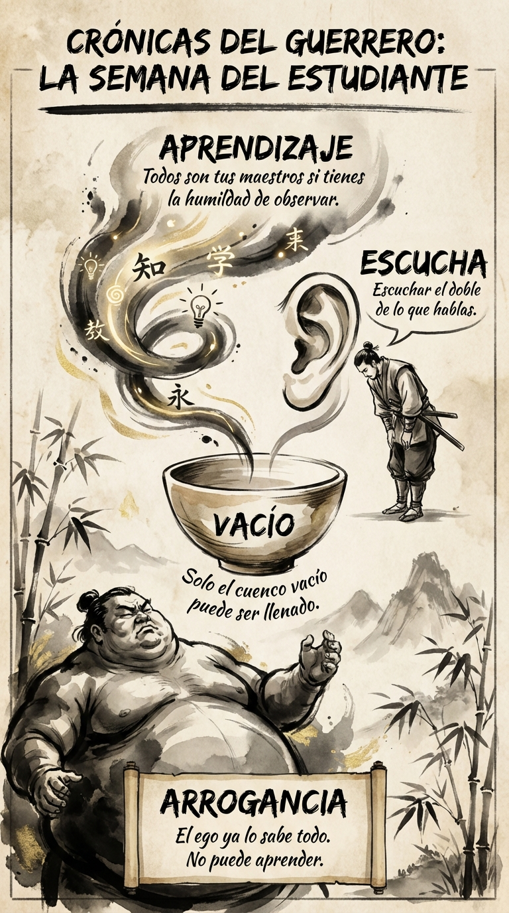

# 14 Octubre: Resumen Semana 39 - El Estudiante

> *"Cuando el alumno está preparado, aparece el maestro."*

### Síntesis Visual
La humildad de la taza vacía.
*   **Arrogancia:** Creer que ya lo sabes todo te cierra.
*   **Vacío:** Solo lo vacío puede ser llenado.
*   **Escucha:** La postura física de la humildad.

### Puntos Clave
1.  **Shoshin:** Mente de principiante, siempre.
2.  **Receptividad:** Escucha para entender, no para responder.
3.  **Maestros:** Todo el mundo sabe algo que tú no sabes.

### Pregunta de Reflexión
¿Hoy has enseñado o has aprendido?
