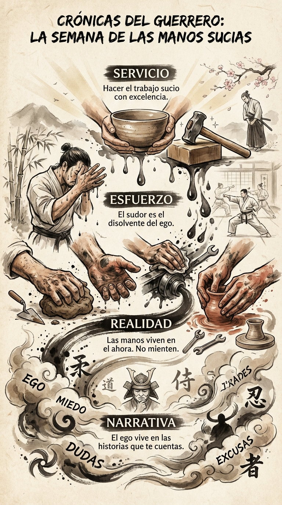

# 21 Octubre: Resumen Semana 40 - Manos Sucias

> *"Las manos son los instrumentos de la inteligencia humana."*

### Síntesis Visual
El trabajo manual como ancla de realidad.
*   **Narrativa:** Las mentiras que el ego te cuenta.
*   **Realidad:** La verdad tangible de la materia.
*   **Esfuerzo:** El sudor limpia la tontería.

### Puntos Clave
1.  **Tierra:** Bajar de la cabeza a las manos.
2.  **Silencio:** Trabajar sin audiencia y sin aplauso.
3.  **Servicio:** Hacer el trabajo sucio con excelencia.

### Pregunta de Reflexión
¿Cuándo fue la última vez que te ensuciaste las manos de verdad?
