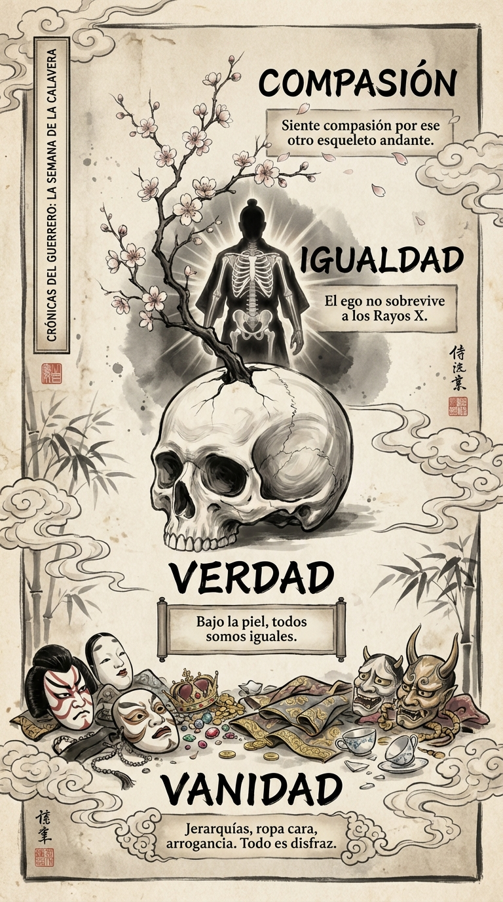

# 28 Octubre: Resumen Semana 41 - La Calavera

> *"Todos somos polvo y sombras."*

### Síntesis Visual
La muerte como el gran igualador.
*   **Vanidad:** Las máscaras sociales que usamos.
*   **Verdad:** El hueso bajo la piel es idéntico en todos.
*   **Compasión:** Ver la fragilidad del otro disuelve el juicio.

### Puntos Clave
1.  **Memento Mori:** Recuerda que vas a morir.
2.  **Rayos X:** Mira a través de las apariencias.
3.  **Igualdad:** El ego no tiene sentido en el cementerio.

### Pregunta de Reflexión
Si murieras hoy, ¿qué importancia tendría tu "imagen"?
