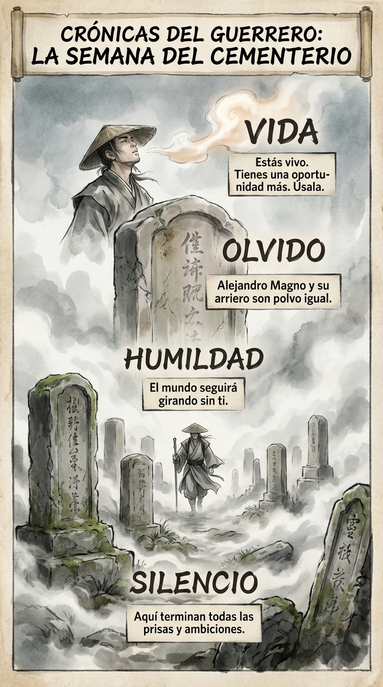

# 07 Noviembre: Resumen Semana 42 - El Cementerio

> *"Aquí yacen los huesos de Alejandro Magno, y los de su arriero."*

### Síntesis Visual
La visita al lugar donde terminan todas las vanidades.
*   **Silencio:** La paz definitiva que pone todo en perspectiva.
*   **Humildad:** El mundo no te necesita para girar.
*   **Vida:** El aliento cálido que te recuerda que aún es tu turno.

### Puntos Clave
1.  **Perspectiva:** Tus problemas "urgentes" son ridículos aquí.
2.  **Igualdad:** La muerte democratiza a reyes y mendigos.
3.  **Oportunidad:** Estás vivo. No desperdicies el billete.

### Pregunta de Reflexión
¿Qué harías hoy si supieras que tu nombre estará en una piedra mañana?
