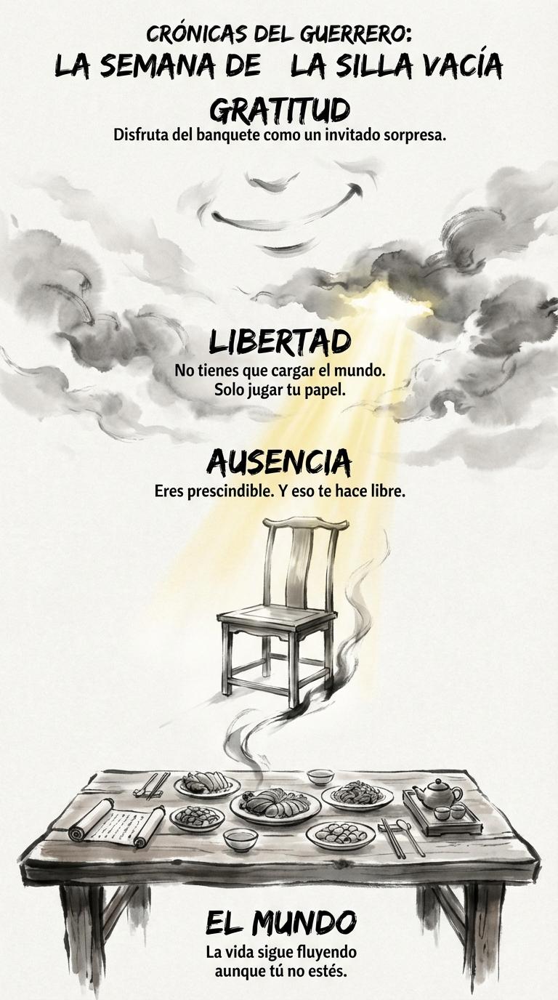

# 14 Noviembre: Resumen Semana 43 - La Silla Vacía

> *"La ausencia es una presencia muy ruidosa."*

### Síntesis Visual
La liberación de saberse prescindible.
*   **El Mundo:** La fiesta sigue sin ti.
*   **Ausencia:** El hueco que dejas es tu legado, no tu presencia.
*   **Libertad:** Si no eres indispensable, eres libre de elegir.

### Puntos Clave
1.  **Ego:** No eres el Atlas que sostiene el cielo.
2.  **Alivio:** Puedes descansar. El mundo aguanta.
3.  **Elección:** Siéntate en la silla porque quieres, no porque debes.

### Pregunta de Reflexión
¿Te sientes culpable por no estar, o agradecido por poder estar?
